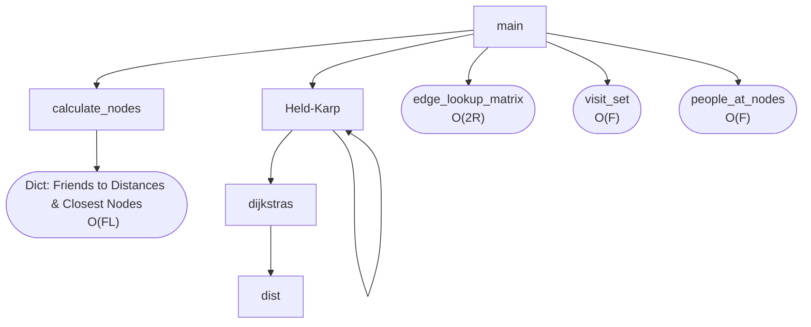

This section of the Algorithmics SAT focuses on a time complexity analysis of the solution in order to establish the efficiency of the algorithm and feasibility in the real world.

Throughout the analysis, note the following variables are used as shorthand:
Let $F =$ number of friends
Let $L =$ number of landmarks
Let $R=$ number of routes

## Algorithm Pseudocode
The following is the final pseudocode reiterated from Part 1, namely for convenience while analysing, since multiple modifications were made to the initial pseudocode.

Let $A =$ starting vertex
Let $B =$ ending vertex
Let $S = \{P, Q, R\}$ or any other vertices to be visited along the way.
Let $C \in S$ (random node in $S$)
```
function main(
	friends: dictionary,
	landmarks: dictionary,
	routes: dictionary,
	timetable: dictionary
):
	// global variable declarations
	concession: bool = Ask the user "Do you posses a concession card?"
	holiday: bool = Ask the user "Is today a weekend or a holiday?"
	user_name: string = Ask the user to select a friend from friends dictionary
	selected_time = Ask the user what time they are leaving
	
	cached_djk: dictionary = empty dictionary
	edge_lookup_matrix: matrix = |V| x |V| matrix that stores a list of edges in each entry
	
	// get distance of all friends from landmarks
	friend_distances: dictionary = calculate_nodes(friends, landmarks)
	visit_set: set = set of all closest nodes from friend_distances
	people_at_nodes: dictionary = all friends sorted into keys of which nodes they are closest to, from visit_set
	
	home: string = closest node of user_name
	
	print all friends, where they live closest to and how far away
	
	print out friends that would take more than 20 minutes to walk (average human walking speed is 5.1 km/h)
	
	hamiltonian_path = held_karp(home, home, visit_set, selected_time)
	
	print how much the trip would cost and how long it would take
	
	print the path of the hamiltonian_path
end function
```
```
function calculate_nodes (
	friend_data: dictionary,
	node_data: dictionary
):
	for friend in friend_data:
		home: tuple = friend['home']
		// initial min vals that will be set to smallest iterated distance
		min: float = infinity
		min_node: node = null
		
		for node in node_data:
			location: tuple = node['coordinates']
			// find real life distance (functional abstraction)
			distance: float = latlong_distance(home, location)
			if distance < min:
				min = distance
				min_node = node
		
		distance_dict[friend]['min_node'] = min_node
		distance_dict[friend]['distance'] = min
end function
```
```
function held_karp (
    start: node,
    end: node,
    visit: set<node>,
    current_time: datetime
):
    if visit.size = 0:
    	djk = dijkstras(start, end, current_time)
		return djk['cost']
    else:
        min = infinity
        For node C in set S:
	        sub_path = held_karp(start, C, (set \ C), current_time)
	        djk = dijkstras(C, end, current_time + toMinutes(sub_path['cost']))
	        cost = sub_path['cost'] + djk['cost']
	        if cost < min:
	            min = cost
	    return min
end function
```
```
function dijkstras (
    start: node,
    end: node,
    current_time: datetime
):
    // Set all node distance to infinity
    for node in graph:
        distance[node] = infinity
        predecessor[node] = null
        unexplored_list.add(node)
    
    // starting distance has to be 0
    distance[start] = 0
    
    // while more to still explore
    while unexplored_list is not empty:
        min_node = unexplored node with min cost
        unexplored_list.remove(min_node)
    
	    // go through every neighbour and relax
        for each neighbour of min_node:
            current_dist = distance[min_node] + dist(min_node, neighbour, current_time + to_minutes(distance[min_node]))
            // a shorter path has been found to the neighbour -> relax value
            if current_dist < distance[neighbour]:
                distance[neighbour] = current_dist
                predecessor[neighbour] = min_node
    
    return distance[end]
end function
```
```
function dist (
	start: node,
	end: node,
	current_time: datetime
):	
	// if the start and end node are the same, it takes no time to get there
	if start = end:
		return 0
	else if edges = null:
		// if no edge exists between nodes
		return infinity
	
	edges = edge_lookup_matrix[start][end]
	distances = []
	
	// go over each possible edge between nodes (multiple possible)
	for edge in edges:
		line = edge.line
		// next time bus/train will be at node (functional abstraction)
		next_time = soonest_time_at_node(timetable, line, start, current_time)
		wait_time = next_time - current_time
		distances.add(edge.weight + wait_time)
	
	return min(distances)
end function
```

## Expected Time Complexity

As explained in Part 1 of the SAT, the algorithm in essence boils down to an applied version of the Held–Karp algorithm, which has a time complexity of $O(n^{2}2^{n})$. Hence, it would make sense for our combination of Held-Karp and Dijkstra's to result in a time complexity slightly larger.

## Call Tree



As we can see, the main function calls a few distinct processes [^1]:

1. First it creates the edge lookup matrix, which is abstracted in the pseudocode. This Big O time is derived from the Pythonic implementation of the lookup matrix as follows [^2]:
   
	```python
	edge_lookup_matrix = {frozenset({edge['from'], edge['to']}): [] for edge in edges}  
	for edge in edges:  
		edge_lookup_matrix[frozenset({edge['from'], edge['to']})].append(edge)
	```
	
	Evidently, this loops over each edge in `edges` twice, resulting in a linear time complexity of $O(2R)$

2. It then calls `calculate_nodes` with an input of both `friends` and `landmarks`, the output of which is used to create our `visit_set`. This Big O time is derived from the fact that `calculate_nodes` is simply a nested for-loop, iterating over each friend and every landmark, resulting in a worst case time complexity of $O(F\times L)$.

3. It now uses the output of `calculte_nodes` (stored as `friend_distances`) to create a set of nodes we need to visit, which is abstracted in the pseudocode. This Big O time is derived from the Pythonic implementation of the set as follows:
   
	```python
	visit_set = set(val['closest_node'] for key, val in friend_distances.items())
	```
	
	Evidently, this loops over each friend once, resulting in a linear time complexity of $O(F)$

4. Similar to the above implementation, the `main` function now creates `people_at_nodes` to create a dictionary of nodes and which people are closest to that node, with a similar $O(F)$ as above.

5. Various other print statements are called, all with $O(F)$ time to display information about each friend.

6. Finally, after all this prep is done, `held_karp` is called to find the shortest hamiltonian path of the graph.

[^1]: This analysis is done assuming that the time complexity of accessing a dictionary, list or array element is $O(1)$, as these basic pseudocode elements are generally done in constant time.

[^2]: Due to the nature of functional abstraction, the implementation of creating the `edge_lookup_matrix` is not specified in the pseudocode. Although it is referred to as a lookup matrix of size $|V| \times |V|$ which would have a quadratic time complexity, the pseudocode has actually been implemented as a dictionary in $O(2R)$ time, which is a bit more efficient. Nonetheless, even if it was changed to $O(L^{2})$, it would make minimal difference to the final asymptotic time complexity.

As we can see from this process and the call tree above, there are 3 main elements that contribute to the time complexity of our algorithm besides `held_karp`: 
1. `calculate_nodes` which contributes $F\times L$ to our time.
2. Calculating the `edge_lookup_matrix`, which contributes $2R$ to our time complexity but simply turns into $R$ when considering the asymptotic complexity.
3. Calculating the `visit_set`, `people_at_nodes` and two other print calls. This contributes $4F$ where 4 accounts for these 4 processes but could be any other arbitrary constant, as this simply turns into $F$ when considering the asymptotic time complexity.

If we let the time complexity of `held_karp` be represented by $HK(n)$ where $n$ denotes the calculated size of the `visit_set`, our current time complexity of the `main` function can be represented as $O(HK(n)+FL+R+F)$.

## Modified Held-Karp Time Complexity

Figuring out the time complexity of the other processes in our algorithm was relatively easy; we can simply look at their pseudocode implementation (or what they would be if they are abstracted) and look at the general number of operations. Held-Karp on the other hand is a bit harder as it is a recursive algorithm, making direct analysis a bit more troublesome. To begin, we can try to represent the modified Held-Karp algorithm as a recurrence relation to aid in mathematical analysis.