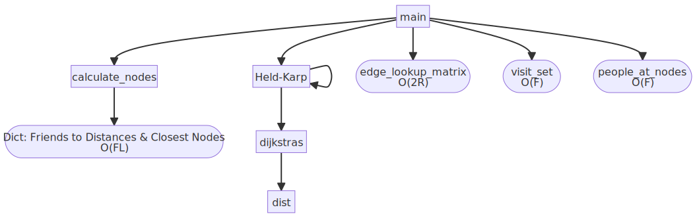

This section of the Algorithmics SAT focuses on a time complexity analysis of the solution in order to establish the efficiency of the algorithm and feasibility in the real world.

Throughout the analysis, note the following variables are used as shorthand:

Let $F =$ number of friends

Let $L =$ number of landmarks

Let $R =$ number of routes

# Time Complexity Analysis

## Expected Time Complexity

As explained in Part 1 of the SAT, the algorithm in essence boils down to an applied version of the Held–Karp algorithm, which has an optimal worst case time complexity of $O(n^{2}2^{n})$. Hence, it would make sense for our combination of Held-Karp and Dijkstra's to result in a time complexity slightly larger.

## Call Tree



As we can see, the [main function](#main-function) calls a few distinct processes [^1]:

1. First it creates the edge lookup matrix, which is abstracted in the pseudocode. This Big O time is derived from the Pythonic implementation of the lookup matrix as follows [^2]:
   
	```python
	edge_lookup_matrix = {frozenset({edge['from'], edge['to']}): [] for edge in edges}  
	for edge in edges:  
		edge_lookup_matrix[frozenset({edge['from'], edge['to']})].append(edge)
	```
	
	Evidently, this loops over each edge in `edges` twice, resulting in a linear time complexity of $O(2R)$

2. It then calls [`calculate_nodes`](#calculate-nodes) with an input of both `friends` and `landmarks`, the output of which is used to create our `visit_set`. This Big O time is derived from the fact that [`calculate_nodes`](#calculate-nodes) is simply a nested for-loop, iterating over each friend and every landmark, resulting in a worst case time complexity of $O(F\times L)$.

3. It now uses the output of [`calculate_nodes`](#calculate-nodes) (stored as `friend_distances`) to create a set of nodes we need to visit, which is abstracted in the pseudocode. This Big O time is derived from the Pythonic implementation of the set as follows:
   
	```python
	visit_set = set(val['closest_node'] for key, val in friend_distances.items())
	```
	
	Evidently, this loops over each friend once, resulting in a linear time complexity of $O(F)$

4. Similar to the above implementation, the [`main`](#main-function) function now creates `people_at_nodes` to create a dictionary of nodes and which people are closest to that node, with a similar $O(F)$ as above.

5. Various other print statements are called, all with $O(F)$ time to display information about each friend.

6. Finally, after all this prep is done, [`held_karp`](#held-karp) is called to find the shortest hamiltonian path of the graph.

[^1]: This analysis is done assuming that the time complexity of accessing a dictionary, list or array element is $O(1)$, as these basic pseudocode elements are generally done in constant time.

[^2]: Due to the nature of functional abstraction, the implementation of creating the `edge_lookup_matrix` is not specified in the pseudocode. Although it is referred to as a lookup matrix of size $|V| \times |V|$ which would have a quadratic time complexity, the pseudocode has actually been implemented as a dictionary in $O(2R)$ time, which is a bit more efficient. Nonetheless, even if it was changed to $O(L^{2})$, it would make minimal difference to the final asymptotic time complexity.

As we can see from this process and the call tree above, there are 3 main elements that contribute to the time complexity of our algorithm besides [`held_karp`](#held-karp): 

1. [`calculate_nodes`](#calculate-nodes) which contributes $F\times L$ to our time.
   
2. Calculating the `edge_lookup_matrix`, which contributes $2R$ to our time complexity but simply turns into $R$ when considering the asymptotic complexity.
   
3. Calculating the `visit_set`, `people_at_nodes` and two other print calls. This contributes $4F$ where 4 accounts for these 4 processes but could be any other arbitrary constant, as this simply turns into $F$ when considering the asymptotic time complexity.

If we let the time complexity of [`held_karp`](#held-karp) be represented by $HK(n)$ where $n$ denotes the calculated size of the `visit_set`, our current time complexity of the [`main`](#main-function) function can be represented as $O(HK(n)+FL+R+F)$.

## Held-Karp Time Complexity

Figuring out the time complexity of the other processes in our algorithm was relatively easy; we can simply look at their [pseudocode implementation](#algorithm-pseudocode) (or what they would be if they are abstracted) and look at the general number of operations. Held-Karp on the other hand is a bit harder as it is a recursive algorithm, making direct analysis a bit more troublesome. To begin, we can try to represent the [modified Held-Karp algorithm](#held-karp) as a recurrence relation to aid in mathematical analysis.

To recap, Held-Karp[^3] works by utilising the fact that every subpath of a path of minimum distance is itself of minimum distance. This means that we can reduce the length of $S$ by one each time by finding the minimum distance/path between $C$ and $B$ while running Held-Karp again on the set $S$ without $C$, but as $C$ as the new value for $B$.   

[^3]: The following variables will be used as shorthand throughout the analysis.
	
	Let $A =$ starting vertex
	
	Let $B =$ ending vertex
	
	Let $S = \{P, Q, R\}$ or any other vertices to be visited along the way.
	
	Let $n$ = the length of the visit set $S$.
	
	Let $C \in S$ (random node in $S$), and to clarify: $C \neq A, B$ as $S$ does not include them

As stated in part 1, this logic can be represented recursively as the following:

$\textrm{Let Cost}_{A \rightarrow B, \space S}=\textrm{The minimum cost of a cycle free path from A to B that visits all the vertices of S.}$

$\textrm{Let } d_{A,B} = \textrm{The minimum cost of travelling from A to B, as outputted by Dijkstra's.}$

$\therefore \textrm{Cost}_{A \rightarrow B, \space S}= \textrm{min}(\textrm{Cost}_{A \rightarrow C, \space S - \{B\}} + d_{CB})$


We can then turn this into a recurrence relation for Big O, where $n$ is the size of the set $S$ and $d(n)$ is the cost function, which in our case is Dijkstra's:

$$
T_{n} = \left\{
        \begin{array}{ll}
            n(T_{n-1}+d(n)) & \quad n > 0 \\
            d(n) & \quad n=0
        \end{array}
    \right.
$$

Now that we have a recurrence relation for Held-Karp in terms of the cost of running Dijkstra's, the next logical step is to find the number of operations required to run Dijkstra's every time (which would be in the worst case scenario where none of our previous calculations are reused).

## Dijkstra's Time Complexity

We can analyse Dijkstra's step by step by viewing all the elements of the [pseudocode](#dijkstras) and evaluating them separately and then add them up together at the end:

1. We can see that initial loop runs for every node, or $L$ times, as each node represents a landmark.

2. In the main while loop, we iterate over every node in the graph, making the while loop run $L$ times as well. 

3. To find the `min_node`, the pseudocode iterates over every single node in the `unexplored_list`. As this list decreases by one each time, the total cost of finding the `min_node` can be represented as $L+(L-1)+(L-2)+\cdots+1+0$. This resembles the triangular numbers, and hence we can also represent the total `min_node` cost as $\frac{L(L+1)}{2}$.

4. The nested for loop inside the while loop is a bit trickier as it covers all neighbours of the current `min_node`. As we have established that every single node in the graph will be the `min_node` at some point, we can use the graph below as an example for how many times this loop would occur. 
   Over here, we can see that $A$ has 2 neighbours, $B$ has 2 neighbours, $C$ has 1 neighbour and $D$ has 1 neighbour. This makes it evident that the amount of times this inner for loop will run is actually just the sum of the degrees of the graph, and by the handshaking lemma, this is simply equal to twice the number of edges in the graph. Hence, the total amount of times this loop will run is $2R$.

	

5. Finally, inside this for loop, we call the `dist` function. As is evident from the pseudocode, this function uses the `edge_lookup_matrix` and goes over the edges between two nodes. In most practical cases, this will simply be one or two edges if multiple bus or train lines go across the same nodes. The `soonest_time_at_node` function is also an abstraction the next available bus/train time given any time at a particular node, which can possibly be implemented into a dictionary to be done in constant time. Due to these two factors, when looking at the asymptotic behaviour, this can be simplified to $O(1)$.
   
Now that we have considered all parts of our implementation of Dijkstra's, we can combine it to get a single cost function: $d(n) = L + L\left(\frac{L(L+1)}{2}+2R\right)= 2LR+\frac{1}{2}L^{3}+\frac{1}{2}L^{2}+L$. Considering the behaviour of this function asymptotically, we can see that it would have a time complexity of $O(2LR + L^{3})$, which is far from ideal and can be improved significantly (Dijkstra's can supposedly be done in $O(L+R\log{L})$ with a min-priority queue).

## Modified Held-Karp Time Complexity

Now that we have an established cost function, we can attempt to evaluate $T_{n}$ in terms of $d(n)$. To reiterate:

$$
T_{n} = \left\{
        \begin{array}{ll}
            n(T_{n-1}+d(n)) & \quad n > 0 \\
            d(n) & \quad n=0
        \end{array}
    \right.
$$
$$
d(n)=2LR+\frac{1}{2}L^{3}+\frac{1}{2}L^{2}+L
$$

Keeping this in terms of $d(n)$, we can create a table to see how this recurrence relation gets bigger as $n$ increases.

| $n$ | $T_{n}$   |
|-----|-----------|
| 0   | $d(n)$    |
| 1   | $2d(n)$   |
| 2   | $6d(n)$   |
| 3   | $21d(n)$  |
| 4   | $88d(n)$  |
| 5   | $445d(n)$ |

The working for this table is shown below, but you can easily keep going to follow the pattern for higher values of $n$:

$n = 0$: $T_{n}=d(n)$

$n = 1$: $T_{n}=1(T_{0}+d(n))=2d(n)$

$n = 2$: $T_{n}=2(T_{1}+d(n))=6d(n)$

$n = 3$: $T_{n}=3(T_{2}+d(n))=21d(n)$

$n = 4$: $T_{n}=4(T_{3}+d(n))=88d(n)$

$n = 5$: $T_{n}=5(T_{4}+d(n))=445d(n)$

### Recurrence Relation

Just looking at the coefficients for a second, we have the following recurrence relation:

$$
T_{n}=n(T_{n-1}+1), \space T_{0}=1
$$ 

It is easy to see that this recurrence relation implies that the running time for the algorithm is factorial. After all, the recurrence relation for $n!$ is $T_{n}=n(T_{n-1}), \space T_{0}=1$. 

### Attempting to Find an Explicit Formula

Now clearly it is of interest to solve this [recurrence relation](#recurrence-relation) and find a non-recursive formula, and here we run into a bit of an issue. If the relation were a linear recurrence with constant coefficients or a typical divide-and conquer recurrence, it would likely be solvable by well-known methods such as telescoping or the Master Theorem, but this is not the case.

#### Theorem 1

While trying to find a way to solve this [recurrence relation](#recurrence-relation), I arrived at the conjecture that $T_{n}=n!+\sum_{i=0}^{n-1} \frac{n!}{i!}$, so let us try to prove it.

> For $n \in \mathbb{N}$, the number of operations used to solve an n-sized visit set TSP by the above algorithm (ignoring the cost function) satisfied the formula: $T_{n}=n!+\sum_{i=0}^{n-1} \frac{n!}{i!}$.

First let us work with the RHS to rearrange it a bit into a more convenient form:
$RHS$

$= n!+\sum_{i=0}^{n-1} \frac{n!}{i!}$

$= n!+\frac{n!}{0!}+\frac{n!}{1!}+\frac{n!}{2!}+\cdots+\frac{n!}{(n-2)!}+\frac{n!}{(n-1)!}$

$= n! \times (1 + \frac{1}{0!}+\frac{1}{1!}+\frac{1}{2!}+\cdots+\frac{1}{(n-2)!}+\frac{1}{(n-1)!})$

##### Base Case

When $n=0$, the base case of the [recurrence relation](#recurrence-relation) says that $T_{0}=1$. The above formula matches that with $T_{0}=0!\times(1+0)=1$, $\therefore$ base case is true.

##### Induction Step

Pick an arbitrary $k \in \mathbb{N}$. Assume that the theorem holds for any TSP with a visit set of size $k$. Thus, it is assumed that $T_{k}= k! \times (1 + \frac{1}{0!}+\frac{1}{1!}+\frac{1}{2!}+\cdots+\frac{1}{(k-2)!}+\frac{1}{(k-1)!})$.

Proof by induction requires showing the following: 

$T_{k+1}= (k+1)! \times (1 + \frac{1}{0!}+\frac{1}{1!}+\frac{1}{2!}+\cdots+\frac{1}{(k-1)!}+\frac{1}{k!})$. 

Next, we can combine the recurrence above with the induction hypothesis as follows:

$LHS$

$=T_{k+1}$

$=T_{k}(k+1)+(k+1)$ (from [recurrence relation](#recurrence-relation)) 

$=[k! \times (1 + \frac{1}{0!}+\frac{1}{1!}+\frac{1}{2!}+\cdots+\frac{1}{(k-2)!}+\frac{1}{(k-1)!})](k+1)+(k+1)$

$=(k+1)! \times (1 + \frac{1}{0!}+\frac{1}{1!}+\frac{1}{2!}+\cdots+\frac{1}{(k-2)!}+\frac{1}{(k-1)!})+(k+1)$

$=(k+1)! \times (1 + \frac{1}{0!}+\frac{1}{1!}+\frac{1}{2!}+\cdots+\frac{1}{(k-2)!}+\frac{1}{(k-1)!})+(k+1)\times\frac{(k+1)!}{(k+1)!}$

$=(k+1)! \times \left(1 + \frac{1}{0!}+\frac{1}{1!}+\frac{1}{2!}+\cdots+\frac{1}{\left(k-2\right)!}+\frac{1}{(k-1)!}+\frac{k+1}{(k+1)!}\right)$

$=(k+1)! \times \left(1 + \frac{1}{0!}+\frac{1}{1!}+\frac{1}{2!}+\cdots+\frac{1}{\left(k-2\right)!}+\frac{1}{(k-1)!}+\frac{1}{k!}\right)$

$=RHS$

Thus $T_{n}=n!+\sum_{i=0}^{n-1} \frac{n!}{i!}$ by the principle of mathematical induction.

#### Theorem 2

Looking all over the web for this, the only place I could find any reference to this sequence is [here](https://oeis.org/A033540), which provides us with the relation $T_{n}=n! + \lfloor e\times n!\rfloor - 1$ for the coefficients. This can be rearranged to $T_{n}=\lfloor n!(e+1)-1 \rfloor$, but just to be sure that this works for every case, we should probably prove it too.

> For $n \in \mathbb{Z}^{+}$, the number of operations used to solve an n-sized visit set TSP by the above algorithm (ignoring the cost function) satisfied the formula: $T_{n}=\lfloor n!(e+1)-1 \rfloor$.

##### Case 1

This is the case where $n=1$. As seen above, $T_{1}=2$ and the proposed formula predicts that $T_{1}= \lfloor 1!(e+1)-1 \rfloor = \lfloor e+1-1 \rfloor = \lfloor e \rfloor = 2$. Thus, the base case holds.

##### Case 2

This is the case where $n>1$. Because of the floor function, if it can be shown that the following difference is small enough, it will probably be possible to prove that this case works as well.
$$
\textrm{Let } \space r_{n}=n!(e+1)-1-T_{n}
$$

##### Lemma 1

> When $n>1$, the following must be true: $r_{n}=\frac{1}{n+1}+\frac{1}{(n+1)(n+2)}+\frac{1}{(n+1)(n+2)(n+3)}+\cdots$

This sum looks like it might be related to the power series for $e^{x}$ at $x=1$. We already know the power series for $e^{x}$, a proof for which can be found [here](https://proofwiki.org/wiki/Power_Series_Expansion_for_Exponential_Function):

$$
e^{x}=\frac{1}{0!}+\frac{x}{1!}+\frac{x^{2}}{2!}+\frac{x^{3}}{3!}+\cdots
$$

It therefore follows that:

$$
e=e^{1}=\frac{1}{0!}+\frac{1}{1!}+\frac{1}{2!}+\frac{1}{3!}+\cdots
$$
Since we know that $T_{n} = n! \times (1 + \frac{1}{0!}+\frac{1}{1!}+\frac{1}{2!}+\cdots+\frac{1}{(n-2)!}+\frac{1}{(n-1)!})$ from the [first theorem](#theorem-1), we can sub both the power series for $e$ and this fact into our definition of $r_{n}$:

$r_{n}$

$= n!(e+1)-1-T_{n}$ (by definition)

$= n!(1+\frac{1}{0!}+\frac{1}{1!}+\frac{1}{2!}+\cdots)-1-T_{n}$ (power series for $e$)

$= n!(1+\frac{1}{0!}+\frac{1}{1!}+\frac{1}{2!}+\cdots)-1-n! \times (1 + \frac{1}{0!}+\frac{1}{1!}+\cdots+\frac{1}{(n-2)!}+\frac{1}{(n-1)!})$ 

$=n!\times(\frac{1}{n!}+\frac{1}{(n+1)!}+\frac{1}{(n+2)!}+\cdots)-1$

$=(1+\frac{1}{n+1}+\frac{1}{(n+1)(n+2)}+\cdots)-1$

$=\frac{1}{n+1}+\frac{1}{(n+1)(n+2)}+\frac{1}{(n+1)(n+2)(n+3)}+\cdots$

$\therefore$ The lemma is true.

##### Lemma 2

> When $n>1$, it is true that $r_{n}<\frac{1}{n+1}+\frac{1}{(n+1)^{2}}+\frac{1}{(n+1)^{3}}+\cdots=\frac{1}{n}$

This is easily proven using the [first lemma](#lemma-1):

$r_{n}$

$=\frac{1}{n+1}+\frac{1}{(n+1)(n+2)}+\frac{1}{(n+1)(n+2)(n+3)}+\cdots$ (Lemma 1)

$< \frac{1}{n+1}+\frac{1}{(n+1)(n+1)}+\frac{1}{(n+1)(n+1)(n+1)}+\cdots$

$= \frac{1}{n+1}+\frac{1}{(n+1)^{2}}+\frac{1}{(n+1)^{3}}+\cdots$


This upper bound above is in the form of an infinite geometric series with ratio $\frac{1}{n+1}$, so the usual formula of $S_{\infty}=\frac{a}{1-r}$ can be used: $r_{n} <\frac{\frac{1}{n+1}}{1-\frac{1}{n+1}} =\frac{1}{n}$.

$\therefore$ The lemma is true.

##### Lemma 3

> If $n > 1$, $0<r_{n}<1$ must hold true.

From [Lemma 1](#lemma-1), it is clear that $r_{n}$ is positive $\therefore 0< r_{n}$. 

Then, by [Lemma 2](#lemma-2), the following must hold: $r_{n}<\frac{1}{n}\le\frac{1}{2}<1$. $\therefore r_{n}<1$.

$\therefore$ The lemma is true.

##### Conclusion

Thus, the proof for this theorem is complete for the case $n>1$:

By the [definition](#case-2) of $r_{n}$, it must be true that $T_{n}+r_{n}=n!(e+1)-1$. Since the [recurrence relation](#recurrence-relation) set up $T_{n}$ as integer and $0<r_{n}<1$ by [Lemma 3](#lemma-3), it must hold that $\lfloor n!(e+1)-1 \rfloor = \lfloor T_{n}+r_{n} \rfloor=T_{n}$.

### Time Complexity

Now that we have proved this works for the coefficients of the cost function, we have the formula of $T(n)=d(n) \lfloor n!(e+1)-1 \rfloor$.The floor function here is just to deal with the difference of $r_{n}$ so that we can get an integer output. Subbing in our known time complexity of $d(n)$, we get a final Big O of $O(\lfloor n!(e+1) \rfloor(2LR+L^{3}))$ for the original implementation of our modified Held-Karp with no caching of its own Dijkstra's outputs. Note that it should already have been obvious that the running time for this algorithm would be in factorial time from the recurrence relation itself, even before finding an explicit formula.

We have already verified that this is correct given that the recurrence relation is correct, but we can also do so by general intuition . If we look back at Part 1, we can get the time taken to run the unoptimised modified Held-Karp on our data with different $n$ values. $(2LR+L^{3})$ should be a constant for any particular predefined graph, meaning that if our Big O time complexity is correct then $\textrm{execution time} \propto \lfloor n!(e+1) \rfloor$[^4].

| n | $\frac{\textrm{execution time}}{\lfloor n!(e+1) \rfloor}$ |
|---|-----------------------------------------------------------|
| 5 | $3\times10^{-5}$                                          |
| 6 | $4\times10^{-5}$                                          |
| 7 | $3\times10^{-5}$                                          |
| 8 | $3\times10^{-5}$                                          |
| 9 | $3\times10^{-5}$                                          |

[^4]: Note that $n<5$ would be rather unreliable due to the decimal inaccuracy of my recorded execution times (4dp)

As we can see, this proportionality is fairly constant, so it would probably be safe to assume that the worst-case time complexity for the unoptimised modified Held-Karp algorithm would be $O(\lfloor n!(e+1) \rfloor(2LR+L^{3}))$, or at least something pretty close to it.

## Optimised Modified Held-Karp Time Complexity

As was established in part 1, this factorial time complexity is not nearly sufficient enough for real world applications. Not only is it simply worse than brute forcing it, it makes it so calculating the Hamiltonian path with just my own friend group takes a ludicrous amount of time. 

One optimisation that was made in Part 1 was the caching of Dijkstra's outputs, so that once Dijkstra's is called from one starting node, all subsequent calls to Dijkstra's will be done in $O(1)$ time. This means that the full Dijkstra's algorithm will only be called a maximum of once for every node in the graph, and then all subsequent calls will just use the cache. Since the time complexity for our Dijkstra's implementation is currently $O(2LR + L^{3})$, we can simply multiply this by the amount of nodes ($L$) to get the worst case scenario for how long Dijkstra's takes.

This transforms our time complexity of $O(\lfloor n!(e+1) \rfloor(2LR+L^{3}))$ into $O(\lfloor n!(e+1) \rfloor + L(2LR+L^{3}))$, which doesn't *look* like that much of a difference, but it means that when looking at the asymptotic time as $n \to \infty$, we can remove the whole second term as it becomes a constant if we are not considering increasing the amount of landmarks and routes, which is much better than multiplying by this value instead. 

As $n \to \infty$, not only does the 2nd term become negligible as explained above, but the floor function also doesn't make a difference because it is simply for making the output an integer number of operations. As such, it is safe to conclude that the implemented algorithm runs in factorial time for an increasing size of the `visit_set`. 

In conclusion, the final algorithm from part one has a time complexity of $O(\lfloor n!(e+1) \rfloor + L(2LR+L^{3}))$, which means that the algorithm runs in factorial time.

# Consequences of Time Complexity

As detailed in the previous section, the final time complexity of the algorithm so far is $O(\lfloor n!(e+1) \rfloor + L(2LR+L^{3}))$. This isn't very ideal, because simply brute forcing it would likely lead to a better worst case time complexity than the current algorithm.

Let's quickly take the example of the time complexities of our two algorithms, the one with cached Dijkstra's values and the one without. The graph/input data detailed in Part 1 has 15 landmarks, 26 routes and a `visit_set` of size 7. For these values, the unoptimised algorithm would take 77,864,700 time units and the algorithm with Dijkstra's caching would take 81,065 time units. This is over 960 times faster in the worst case scenario, but as shown in part 1, about 31 times faster in the average case. Below is a discussion on the real world consequences of this time performance difference, as well as how practical this algorithm is for real world use cases.

## Revisiting Problem Requirements

This algorithm was made to solve the general problem of planning trips with friends, but more specifically the scenario where my friends decided that we want to travel in one big travel party and I am to start and end my day at my house, picking up all my friends along the way. In other words, this algorithm is designed for the real world use case of finding the shortest circuit that picks up all my friends as we travel. 

Let us consider some requirements for this real world use case. By my own general estimates, most people would only have about 5 to 10 close friends that they would travel like this with. Similarly, most people live relatively close to their friends, so the case of 15 landmarks (or train stations/buses) and 26 routes (or train/bus lines) is realistic. As shown in Part 1, below is the real world performance as $n \in [0,12]$ and $L=15,\space R=26$.

| $n$ (size of `visit_set`) | $t$ (execution time in seconds, 4dp) |
|---------------------------|--------------------------------------|
| 0                         | 0.0001                               |
| 1                         | 0.0001                               |
| 2                         | 0.0001                               |
| 3                         | 0.0001                               |
| 4                         | 0.0001                               |
| 5                         | 0.0005                               |
| 6                         | 0.0060                               |
| 7                         | 0.0287                               |
| 8                         | 0.2148                               |
| 9                         | 1.6055                               |
| 10                        | 17.4555                              |
| 11                        | 171.6719                             |
| 12                        | 1750.1065                            |

Presuming most people's friends live somewhat close to each other, even in the case where we have 10 close friends that we want to hang out with, most of them probably share "pickup points" which reduces the size of the `visit_set`. For example, the current input data has 18 friends but a visit set of size 7! This means that in almost every case $n<10$, and if people were using this in a mapping application like Google Maps for example to have certain pickup points along the way, this would most likely be fine, returning a result in a couple seconds at worst.

The problems start arising when this problem is scaled up more. As the algorithm is in factorial time, it scales rather terribly and has minimal improvements over brute force, if any improvements at all. The algorithm more generally is a solution for TSP with a graph that is not necessarily complete, and this can be applied to a lot more real life applications than just houses of friends. For example, if the person starting the trip was a truck driver for a logistics company rather than me, and the pickup points were necessary delivery points rather than the closest meeting points for friends, we would have a completely different scale in which the algorithm would perform very poorly. Not only would these pickup points be across a *much* larger distance, meaning the value of $R$ will likely be much higher, but there are potentially many more pickup/dropoff points in a day than the previous scenario, causing both $L$ and $n$ to be greatly larger. Simply put, a factorial time complexity of $O(\lfloor n!(e+1) \rfloor + L(2LR+L^{3}))$ just does not scale very well for many other practical use cases besides the one explored, and even then, if the party of friends was sufficiently large, the algorithm would crawl to a halt. Looking at the example above, with just $12$ pickup points the algorithm ground to a staggering half an hour of required time when tested on my machine.

Due to the fact that most users are not willing to wait more than a couple seconds for a result, the practical input sizes are $n < 10$, $L \le 15$, $R \le 30$. These values are taken from the input values that produced the table above while considering the time complexity of the algorithm. This is not a very big scope of possible use cases, and therefore optimisations are most definitely needed. Although this algorithm as of now is suitable to the problem's requirements, it very quickly falls apart for a "power user" or anyone else that has a different use-case in mind. Another possible alternative is using "approximate" solutions that have a better time complexity which may not provide the *most* optimal solution, but will most definitely scale better for a variety of use cases.

To conclude, this algorithm's time complexity directly influences how practically it can be used in the real world to solve the problem it is intended to solve. Users of a program as such would expect a result within seconds at most, and the practical input sizes are therefore restricted to those described above. 

# Appendix

## Possible Optimisations

It is also worth quickly noting the possible optimisations the findings of the report above lead to. 

1. The current implementation of Dijkstra's is far from optimal: the current algorithm has a cubic time complexity but with a a min priority queue this can supposedly be reduced to $O(L+R\log{L})$.
   
2. The abstraction of `soonest_time_at_node` can be implemented as a dictionary that is accessed in constant time but is currently implemented as two for loops that makes the [`dist`](#distance-function) function more complex than necessary. 
   
3. The biggest optimisation needed is the caching of the Held-Karp outputs, meaning that subpaths are calculated once only, and all subsequent subpaths will be read in $O(1)$ time (basically dynamic programming by definition). This should probably help the factorial time complexity, though it might be hindered by the fact that a different starting time means that the whole subpath is different which decreases how effective this optimisation is.
   
4. Finally, it may be worth considering approximate solutions. This being said, the scope of the problem to solve does *just* fit into the practical input sizes that the algorithm allows, but definitely limits its usefulness and real world use cases. In many times, the *best* solution is not needed, just a relatively good one.

## Algorithm Pseudocode
The following is the final pseudocode reiterated from Part 1, namely for convenience while analysing, since multiple modifications were made to the initial pseudocode.

Let $A =$ starting vertex
Let $B =$ ending vertex
Let $S = \{P, Q, R\}$ or any other vertices to be visited along the way.
Let $C \in S$ (random node in $S$)

### Main Function

```
function main(
	friends: dictionary,
	landmarks: dictionary,
	routes: dictionary,
	timetable: dictionary
):
	// global variable declarations
	concession: bool = Ask the user "Do you posses a concession card?"
	holiday: bool = Ask the user "Is today a weekend or a holiday?"
	user_name: string = Ask the user to select a friend from friends dictionary
	selected_time = Ask the user what time they are leaving
	
	cached_djk: dictionary = empty dictionary
	edge_lookup_matrix: matrix = |V| x |V| matrix that stores a list of edges in each entry
	
	// get distance of all friends from landmarks
	friend_distances: dictionary = calculate_nodes(friends, landmarks)
	visit_set: set = set of all closest nodes from friend_distances
	people_at_nodes: dictionary = all friends sorted into keys of which nodes they are closest to, from visit_set
	
	home: string = closest node of user_name
	
	print all friends, where they live closest to and how far away
	
	print out friends that would take more than 20 minutes to walk (average human walking speed is 5.1 km/h)
	
	hamiltonian_path = held_karp(home, home, visit_set, selected_time)
	
	print how much the trip would cost and how long it would take
	
	print the path of the hamiltonian_path
end function
```

### Calculate Nodes

```
function calculate_nodes (
	friend_data: dictionary,
	node_data: dictionary
):
	for friend in friend_data:
		home: tuple = friend['home']
		// initial min vals that will be set to smallest iterated distance
		min: float = infinity
		min_node: node = null
		
		for node in node_data:
			location: tuple = node['coordinates']
			// find real life distance (functional abstraction)
			distance: float = latlong_distance(home, location)
			if distance < min:
				min = distance
				min_node = node
		
		distance_dict[friend]['min_node'] = min_node
		distance_dict[friend]['distance'] = min
end function
```

### Held-Karp

```
function held_karp (
    start: node,
    end: node,
    visit: set<node>,
    current_time: datetime
):
    if visit.size = 0:
    	djk = dijkstras(start, end, current_time)
		return djk['cost']
    else:
        min = infinity
        For node C in set S:
	        sub_path = held_karp(start, C, (set \ C), current_time)
	        djk = dijkstras(C, end, current_time + toMinutes(sub_path['cost']))
	        cost = sub_path['cost'] + djk['cost']
	        if cost < min:
	            min = cost
	    return min
end function
```

### Dijkstra's

```
function dijkstras (
    start: node,
    end: node,
    current_time: datetime
):
    // Set all node distance to infinity
    for node in graph:
        distance[node] = infinity
        predecessor[node] = null
        unexplored_list.add(node)
    
    // starting distance has to be 0
    distance[start] = 0
    
    // while more to still explore
    while unexplored_list is not empty:
        min_node = unexplored node with min cost
        unexplored_list.remove(min_node)
    
	    // go through every neighbour and relax
        for each neighbour of min_node:
            current_dist = distance[min_node] + dist(min_node, neighbour, current_time + to_minutes(distance[min_node]))
            // a shorter path has been found to the neighbour -> relax value
            if current_dist < distance[neighbour]:
                distance[neighbour] = current_dist
                predecessor[neighbour] = min_node
    
    return distance[end]
end function
```

### Distance Function

```
function dist (
	start: node,
	end: node,
	current_time: datetime
):	
	// if the start and end node are the same, it takes no time to get there
	if start = end:
		return 0
	else if edges = null:
		// if no edge exists between nodes
		return infinity
	
	edges = edge_lookup_matrix[start][end]
	distances = []
	
	// go over each possible edge between nodes (multiple possible)
	for edge in edges:
		line = edge.line
		// next time bus/train will be at node (functional abstraction)
		next_time = soonest_time_at_node(timetable, line, start, current_time)
		wait_time = next_time - current_time
		distances.add(edge.weight + wait_time)
	
	return min(distances)
end function
```
