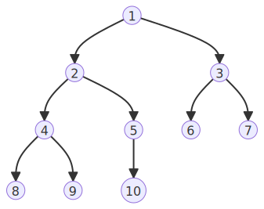
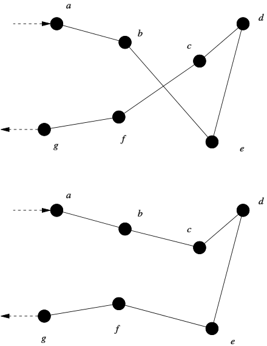

This section of the Algorithmics SAT focuses improving the original data model and algorithm to solve the original problem more efficiently and effectively. 

Throughout the analysis, note the following variables are used as shorthand:

Let $F =$ number of friends

Let $L =$ number of landmarks

Let $R =$ number of routes

\newpage

## Suggested Improvements

From Part 2, there were various possible optimisations that became evident from the time complexity analysis. These read as follows:

1. The [current implementation of Dijkstra's](#dijkstras) is far from optimal: the current algorithm has a cubic time complexity but with a min priority queue this can supposedly be reduced to $O(L+R\log{L})$.

2. The abstraction of `soonest_time_at_node` can be implemented as a dictionary that is accessed in constant time but is currently implemented as two for loops that makes the `dist` function more complex than necessary.

3. The biggest optimisation needed is the caching of the Held-Karp outputs, meaning that subpaths are calculated once only, and all subsequent subpaths will be read in $O(1)$ time (basically dynamic programming by definition). This should probably help the factorial time complexity, though it might be hindered by the fact that a different starting time means that the whole sub-path is different which decreases how effective this optimisation is.

4. Finally, it may be worth considering approximate solutions. This being said, the scope of the problem to solve does *just* fit into the practical input sizes that the algorithm allows, but definitely limits its usefulness and real world use cases. In many times, the *best* solution is not needed, just a relatively good one.

The first three can be implemented and compared relatively easily, so they will be the focus of this section.

### Improving Dijkstra's Implementation

As stated above, the [current implementation of Dijkstra's](#dijkstras) is naïve because each iteration of the while loop requires a scan over all edges to find the one with the minimum distance, but the relatively small change of using a [heap](#heaps) as a min priority queue allows us to find the edge with minimum distance faster. In terms of the [pseudocode](#dijkstras), this just means turning `unexplored_list` into a min priority queue, where the priority is based on the distance to the node.

Note that even though the `unexplored_list` simply appears as a priority queue in the pseudocode, for this change to be beneficial the priority queue data structure must itself be implemented efficiently, using something like a [heap](#heaps). 

See the [modified version of Dijkstra's](#dijkstras-1) for the pseudocode.

#### Heaps

In most implementations (such as the Python implementation we will be testing with), the inner workings of how a min priority queue works will be abstracted and hence doesn't *need* to be worried about. Nonetheless, it is worth exploring how they are actually implemented, a popular method being min heaps!

A heap is a special tree-based data structure in which the tree is a complete binary tree. In other words, each node has exactly two children and every level will be completely filled, except possibly the deepest level. In a min heap, the parent nodes are always smaller than their children, meaning that the root node is the very smallest element. 

Interestingly, since there are no gaps in the tree, the heap can actually be stored simply as an array with additional logic for adding and removing from the priority queue.



##### Insertion

When inserting an element, it goes in the next empty spot looking top to bottom, left to right. If that's not where the element should actually go, we can "bubble it up" until it is, meaning that we can swap that element with its parent node repeatedly until it has gone up the tree enough to be in the correct position. Since it is a binary tree, we can do this in $O(\log{n})$ time.

##### Deletion

Since we would want to remove the smallest node, this would of course be the root node. Removing the root node would create an empty spot, so when we remove the root, we instead fill that with the last element added. Similar to above, since this element might not be in the right spot, we take that element and "bubble it down" until it is, this time swapping with the smaller of the two children repeatedly. Similar to above, we can do this in $O(\log{n})$ time.

#### Improvement

| Visit Set Size | Initial Algorithm (s) | Improved Dijkstra's (s) |
|---|---|---|
| 8 | 1.4038 | 1.2842 |
| 9 | 3.9718 | 3.9315 |


All times are the average of 10 trials. Evidently, the improvement is slight, if any improvement at all. 

### Improving Distance Function

To find the `soonest_time_at_node`, the original Pythonic implementation was using a nested for loop to find when the next train/bus would arrive. This is thoroughly inefficient, namely due to the amount of times that the `dist` function is called, meaning that there would be a lot of overlap. This *could* be improved using dynamic programming, but since there is a fixed amount of time in a day (24 hours), it doesn't actually take that long to precompute this waiting time and store it along with the rest of our data. The pseudocode for this function is below:

```
time_data = dictionary of dictionaries

for line in line_data:
    for start_node in line_data[line]['timetable']:
        for current_time in every minute of a day:
            // calculate next time at node
            for arrival_time at start_node:
                if arrival_time >= current_time and is first:
                    next_time = arrival_time
            
            wait_time = next_time - current_time
            add wait_time to time_date
```

This produces a rather large dictionary of wait times, but the change to $O(1)$ time complexity pays off, even if space complexity is sacrificed.

#### Improvement


| Visit Set Size | Initial Algorithm (s) | Improved Dijkstra's (s) | Improved Dist (s) |
|---|---|---|---|
| 8 | 1.4038 | 1.2842 | 0.2746 |
| 9 | 3.9718 | 3.9315 | 2.2123 |
| 10 | 27.8881 |  | 24.4954 |


All times are the average of 10 trials and improvements are cumulative. The improvement seems quite large for smaller visit set sizes, but evidently this does not influence the Big O much as $\lim n \rightarrow \infty$. 

### Improving Held-Karp Implementation

Maybe the biggest flaw in the initial algorithm is that [Held-Karp](#held-karp) did not use dynamic programming. Due to the way Held-Karp works (explained previously), there are many overlapping problems and without the caching of these outputs, they will be calculated repeatedly unnecessarily. Since this main function is what contributes to the majority of the time complexity, improving it should make the algorithm scale better.

As we did with Dijkstra's in Part 1, caching can be done with an intermediary function, `fetch_hk`, which only runs `held_karp` if the value hasn't already been stored.

The pseudocode for this process is relatively simple and [can be found below](#fetch-held-karp-cached).

#### Improvement

| Visit Set Size | Initial Algorithm (s) | Improved Dijkstra's (s) | Improved Dist (s) | Improved Held-Karp (s) |
|---|---|---|---|---|
| 8 | 1.4038 | 1.2842 | 0.2746 | 0.0264 |
| 9 | 3.9718 | 3.9315 | 2.2123 | 0.0579 |
| 10 | 27.8881 |  | 24.4954 | 0.1460 |
| 11 |  |  |  | 0.2339 |
| 12 |  |  |  | 0.5172 |
| 13 |  |  |  | 1.2122 |
| 14 |  |  |  | 2.8075 |


All times are the average of 10 trials and improvements are cumulative. The improvement from this change is much better than the previous changes, likely changing our Big O time from factorial to exponential, as seen by the roughly doubling running times. This can be verified by creating a line of best fit from the data above, which works out to be $t(n) \approx a^{n-b}$ where $a=2.29792$ and $b=12.7609$. This has an $R^{2}$ value of $0.9996$, which provides us with a relatively high confidence that the new algorithm has $\Theta(2^{n})$. According to this line of best fit, $n=20$ would take about 7 minutes and 53 seconds, while $n=30$ would take almost 3 weeks.

It is worth noting that although this does improve the time complexity by a large factor, the cache also takes up a lot of space, making the space complexity worse. This tradeoff is quite good in most cases since modern devices have plenty of memory and storage, but in the case that space complexity is a constraint, this may be an unideal optimisation.

\newpage

## Practicalities of an Exact Algorithm

Though the algorithm has seen a dramatic improvement from factorial time to likely exponential time, it still maintains a lot of the issues that the previous version possessed. Namely, because exponential time still does not scale very well, the practical input size for $n$ is still very limited, changing from about $n\leq 9$ to $n \leq 14$.

As stated in Part 2, this is mostly sufficient for the specific use case of the problem outlined in most cases since the amount of friends people would hang out with in this fashion is intrinsically small, as it only applies itself to close friends. Because of this, even if someone does have a large amount of close friends, it is unlikely that the visit set that gets computed is larger than 14 (the current input data has 18 friends but a visit set of size 7). As such, for the practical cases of this specific problem, the exact algorithm is sufficient, and also works for adjacent scenarios such as mapping applications (Google Maps, etc.) wanting to have certain pickup points along the way.

The algorithm begins to become impractical once the problem is scaled up more as a general solution for the TSP. For example, if a truck driver for a logistics company wanted an optimal route given a list of pickup points, this would very quickly surpass the practical limit of $n \leq 14$, and the graph would be much larger as well. In wider applications like this, using an exact algorithm is simply not useful, and we would rather want paths that have a "small enough" cost but have a feasible time complexity. This is where we get into the realm of [approximate algorithms](#approximateheuristic-algorithms).

### Tractability

It is important to note that the problem that was initially described can simply be generalised as the Travelling Salesman Problem, which is famously NP-Hard meaning that there is no known polynomial time solution for the problem.

Due to the fact that our final exact algorithm implementation had its execution time double every time $n$ was increased by 1, it is safe to assume that the algorithm runs in exponential time at best, meaning that it is still considerably intractable for large inputs due to the exponential growth.

From this, it is clear that the problem does not become tractable based on the above implementation, and it will be hard to make an exact algorithm that is much faster. This is why [approximate algorithms](#approximateheuristic-algorithms) are worth considering, namely those that have performance guarantees of worst cases that are within a certain factor of the minimal cost solution. They provide a trade-off between speed and optimality, and while they make the problem more tractable than exact algorithms, they do not make it completely tractable due to their approximate nature and how they do not always produce the optimal solution.

## Approximate/Heuristic Algorithms

The general idea of most approximation algorithms is we can start with an initial candidate solution and then keep making changes to see if we can get better. The initial candidate solution need not be good, but it would certainly help produce results closer to the global optimum after a certain amount of iterations. 

One of the most intuitive ideas to generate an initial candidate solution would be to visit the closest node in the visit set from any given node, and this can more formally be described as the [Nearest Neighbour Heuristic](#nearest-neighbour-heuristic).

### Nearest Neighbour Heuristic

The Nearest Neighbour (NN) algorithm is a greedy (and somewhat naïve) approach where the closest unvisited city is selected as the next destination. This method produces a reasonably short route, but usually not the optimal one. The informal steps of this approximate algorithm are listed below:

1. Mark every vertex as unvisited.

2. Set the starting vertex as the current vertex **u**, marking it as visited.

3. Find the shortest outgoing edge from **u** to an unvisited vertex **v**.

4. Set **v** as the current vertex **u** and mark it as visited.

5. If all vertices have been visited, terminate, if not, go to step 3.

This is a very simple algorithm, but as is the case with most greedy approaches, it can quite easily miss shorter routes. For this specific use case step 3 may cause a few issues in terms of time complexity, as unlike the normal TSP, our graph is not complete. This means that at this step, we would need to run Dijkstra's at every single node in the graph and then sort them to find the shortest path, which is inefficient. 

To make this slightly faster we *could* simply choose the first unvisited node in the visit set to go to, but that would still require Dijkstra's to run at every node to find a path, meaning that only the time spent sorting would be saved (which is minimal since Dijkstra's will already have them sorted from the min heap). The problem with this approach is that it will produce a less optimal solution, causing the algorithm to have to spend a longer amount of time improving the solution in the simulated annealing phase. This means that it is a bit of a tradeoff, and for now the shortest node will be chosen.

To avoid using Dijkstra's at all, it is worth considering candidate solutions based on the MST, such as those created by Christofides' Algorithm, which may turn out to be faster. This can be further considered to optimise the algorithm, but for simplicity's sake, the NN Heuristic will be continued with.

Below is the pseudocode to generate an initial candidate solution. Note that in this pseudocode, `fetch_djk` only has the input of the starting node and visit set and returns the path to the closest node in the visit set, so it is a slightly modified version of the `fetch_djk` outlined above.

```
// creates a canditate solution using the NN Heuristic
function canditate_solution (
    start: node, 
    end: node,
    visit: set of nodes,
    current_time: datetime,
):
    path = [start]
    current_vertex = start
    cost = 0
    
    while len(visit) != 0:
        closest_node = fetch_djk(current_vertex, visit, current_time)
        path.add(closest_node)
        cost += closest_node.cost
        visit.remove(closest_node)
        current_vertex = closest_node
    
    // go back to the end node
    closest_node = fetch_djk(current_vertex, end, current_time)
    path.add(closest_node)
    cost += closest_node.cost
    
    return {'path': path, 'cost': cost}
end function
```

### Pairwise Exchange

Once we have an initial candidate solution that has a reasonable cost for the traversal, a natural question to ask is "how can we make it better?" More specifically, it is worth considering how we could make modifications to generate a better solution.

One way to do this is random swapping, where we randomly pick two cities in the current tour order, and swap them. The goal is to see if these random swaps will ever create a lower cost tour, and if they do, we can accept the new solution. This is a form of the Hill Climbing heuristic, where we keep moving around the sample space to see if we can improve our solution at all.

A slightly more sophisticated technique than randomly swapping the nodes is a method called Pairwise Exchange or 2-opt. The main idea is that we can select any two edges and reconfigure them in the only other way possible with the hopes that this may result in a lower cost tour.


{ height=360px } 

For example, in the diagram above, it can be seen that the pairs $b-e$ and $c-f$ cross over each other, so the edges can be swapped so that they do not. 

More simply, when imagined as a one dimensional array, this could be viewed as the following transformation where we simply reversed the order of the path $e \leftrightarrow d \leftrightarrow c$:

1. $a \leftrightarrow \mathbf{b \leftrightarrow e} \leftrightarrow d \leftrightarrow \mathbf{c \leftrightarrow f} \leftrightarrow g$
2. $a \leftrightarrow \mathbf{b \leftrightarrow c} \leftrightarrow d \leftrightarrow \mathbf{e \leftrightarrow f} \leftrightarrow g$

In essence, this "untangles" our candidate solution and can go through all the possible edge combinations much faster than simply randomly switching nodes (which has a much lower chance of being any better).

It is worth noting that the 2-opt technique (where 2 edges are selected and reconfigured) can actually be extended to any number of edges, known as *k*-opt for $k$ edges. It might be worth working with a larger amount of edges (3-opt for example), but for simplicity's sake, 2-opt will the one continued with.

The above notion of reversing the order of a certain path can be expanded upon to develop our pseudocode. The informal steps for this process are listed below:

Let $u$ and $v$ be the first vertices of the edges that are to be swapped.
Let $\textrm{tour}$ be an array of vertices that defines our candidate path.
1. Add all vertices up to and including $u$ in order.
2. Add all vertices after $u$ up to and including $v$ in reverse order.
3. Add all vertices after $v$ in order.

In the example above, $u$ would have been $b$ and $v$ would have been $c$.

This basic logic can be combined with the Hill Climbing Heuristic to provide a simple way to improve the initial candidate solution. Here, the `calculate_cost` function would simply add up the cost of traversing the graph in the input order, using Dijkstra's at every vertex.

```
function pairwise_swap (
    u: integer,
    v: integer,
    path: path of nodes
):
    new_tour = []
    
    for i in [0, u]:
        new_tour.add(path[i])
    for i in [v, u):
        new_tour.add(path[i])
    for i in (v, len(path)]:
        new_tour.add(path[i])
    
    return new_tour
end function

function calculate_cost (
    path: path of nodes,
    current_time: datetime
):
    cost = 0
    time = current_time
    
    for i from 0 to len(path) - 1:
        djk = fetch_djk(path[i], path[i + 1], current_time)
        cost += djk['cost']
        time += djk['cost'] number of minutes
    
    return cost
end function

function hill_climbing (
    candidate: path of nodes,
    current_time: datetime,
    fail_count: int = 0
):
    if fail_count < 200:
        cost = calculate_cost(candidate, current_time)
        u = random number from 1 to len(candidate) - 1 inclusive
        v = random number from u to len(candidate) - 1 inclusive
        
        new_tour = pairwise_swap(u, v, candidate)
        new_cost = calculate_cost(new_tour, current_time)
        
        if new_cost  accept
            return hill_climbing(new_tour, current_time, 0)
        else:
            // new cost is worse -> go again
            return hill_climbing(candidate, current_time, fail_count + 1)
    else:
        return candidate
end functionNote that the above range of  and  values has been chosen to prevent them from referring to the start or end of the tour, since in our particular use case we would like to force the tour to start and end at particular locationsSimulated AnnealingOne of the problems with the above solution is that it will quite easily get stuck on a local minimum. Demonstrated by the graph below, the Hill Climbing Heuristic is blind to anything besides its local vicinity. As such, there may be an overall better solution, but not one that can be achieved by constantly improving the current candidate solution. In other words, sometimes things have to get worse before they get better, especially for the TSP.Currently, once the Hill Climbing algorithm is implemented in Python, it produces a somewhat suboptimal result. It is hardcoded to terminate after it has had 200 consecutive iterations that have seen no improvement. Sometimes, it can terminate on a relatively good result, but in other cases it gets stuck on much more sub-par candidates. This can be demonstrated by the two paths bellow, both of which the Hill Climbing algorithm terminated on.The cost has been improved from 234.0 to 227.0
['Brandon Park', 'Oakleigh', 'Wheelers Hill Library', 'CGS WH', 'Chadstone', 'Caulfield', 'Flinders Street', 'Camberwell', 'Parliament', 'Melbourne Central', 'Brighton Beach', 'Richmond', 'Mount Waverley', 'Glen Waverley', 'Brandon Park']The cost has been improved from 277.0 to 270.0
['Brandon Park', 'CGS WH', 'Glen Waverley', 'Mount Waverley', 'Camberwell', 'Chadstone', 'Caulfield', 'Brighton Beach', 'Flinders Street', 'Melbourne Central', 'Parliament', 'Richmond', 'Oakleigh', 'Wheelers Hill Library', 'Brandon Park']Simulated Annealing is a concept that builds off of this idea of possibly selecting a worse solution to hopefully get to the global optimum. Namely, it tries to explore as much of the search space as possible at the start (by being more likely to select worse candidates) and then gradually reduces this chance so that it can converge on a better solution. The logic behind this is quite similar to Hill Climbing:Start with a candidate solution, from a previous algorithm or just a random tour.Modify this candidate by trying to apply some tour improvements, in this case 2-opt.Decide whether to accept the new solution or stay with the old one.The key difference here is step 3. In both algorithms, if the new tour's cost is lower than the previous one, we will always accept it. If the cost is more than the current solution, with some probability, we will actually accept the higher cost solution but this probability will decrease over time.How this probability is determined is mostly based on a parameter called the "Temperature" . At the start we will initialise this to a high value, and a higher temperature means we are more likely to select a worse solution. Any  will work, but we want to gradually reduce our temperature over time, so that it can influence some probability function.There are usually three main types of temperature reduction functions, where  is the factor by which the temperature is scaled after  iterations:Linear Reduction Rule: Geometric Reduction Rule: Slow-Decrease Rule[^1]: [^1]: This rule is not often used, but  is a different constant that we'll get to later.Each of these reduction rules decreases the temperature at a different rate, so they may be better for different use cases. For now, we will settle upon the Geometric Reduction Rule (as it is the most common).Starting at the initial temperature, the algorithm will loop through  iterations and then decrease the temperature according to the selected temperature reduction function at the end of every iteration. This loop will stop once the terminating condition is reached, generally some low cutoff temperature where we have determined an acceptable amount of the search space has been explored. Finally, within each iteration, we will use our temperature, the old cost and the new cost to determine whether we accept the new solution or not. This follows the formula below where :To demonstrate, if the new cost is less than or equal to the old cost, the new cost will always be accepted. If on the other hand the new cost is greater, then we might pick it based on the formula shown above. This equation is inspired by the formula for the energy released by metal particles as they cool down from thermodynamics: . This process is known as annealing, hence the name of the algorithm! Borrowing this equation from physics turns out to be quite elegant, giving us a probability distribution known as the Boltzman distribution.It is worth noting the different parameters that can be tuned, and the effectiveness of the algorithm depends on the choice of these parameters: - Normalising ConstantThe choice of this constant is dependent on the expected variation in the performance measure over the search space, If the chosen value of  is higher, the probability of accepting a solution is supposedly also higher in later iterations. In our use case, we can simply play around with this number and see if it changes anything! - Initial TemperatureThis is simply the temperature we start with, and should be relatively close to one so that we accept a lot of new solutions at the start. For now, we will set . - Temperature Scaling FactorAs explained above, depending on the temperature reduction function chosen,  will reduce it at a different rate. Low  values restrict the search space faster, so we can choose  for now.The number of iterations before the temperature is updated can also be played around with, for now this will be set to 5. Also, the cutoff terminating temperature can also be set to allow the algorithm to search for longer.The above should demonstrate the main weakness of simulated annealing: there are a lot of tunable parameters that vastly influence the performance of the algorithm. If our input data is very sparse, the algorithm may perform much worse for certain use cases. Nonetheless, it is most definitely an improvement over the Hill Climbing algorithm as it does not increase time complexity or space complexity, but it does provide a more accurate output.Below is the pseudocode that summarises the above discussion:function acceptance_probability (
    old_cost: number,
    new_cost: number,
    beta: number,
    temp: number
):
    c = new_cost - old_cost
    
    if c  min_temp:
        for n from 1 to temp_change:
            u = random number from 1 to len(candidate) - 1 inclusive
            v = random number from u to len(candidate) - 1 inclusive
            
            new_tour = pairwise_swap(u, v, candidate)
            new_cost = calculate_cost(new_tour, current_time)
            
            ap = acceptance_probability(old_cost, new_cost, beta, temp)
            
            if ap > random float from 0 to 1:
                candidate = new_tour
                old_cost = new_cost
            
        temp *= alpha
        
    return candidate
end functionNormalising FunctionSomething that may have become apparent when viewing the above examples is how the paths generated by this approximate solution are somehow much shorter than those generated by Held-Karp. This is due to the fact that the implementation of Held-Karp is not restricted to only visiting each node once, whereas the approximate algorithms are. Due to this, we get some interesting behaviour that needs to be accounted for.['Brandon Park', 'Oakleigh', 'CGS WH', 'Wheelers Hill Library', 'Caulfield', 'Flinders Street', 'Melbourne Central', 'Parliament', 'Glen Waverley', 'Chadstone', 'Brighton Beach', 'Camberwell', 'Mount Waverley', 'Richmond', 'Brandon Park']The above is a path generated by the Hill Climbing algorithm. The issue to note is that it advises the user to go from Glen Waverley to Chadstone, but there is no edge between them for this to happen. Since the algorithms have been using Dijkstra's to go to any other node, it has in essence been treating our tour as a complete graph, even though it is not. As such, the edges in between these locations need to be added in again.This is quite simple to do, and is similar to the calculate_cost, except the paths are added instead of the costs.function normalise_path (
    path: path of nodes,
    current_time: datetime
):
    return_path = []
    time = current_time
    
    for i from 0 to len(path) - 1:
        djk = fetch_djk(path[i], path[i + 1], current_time)
        time += djk['cost'] number of minutes
        // this is to prevent the last and first item double up
        return_path += everything in djk['path'] except last item
    
    return_route.add(last item in route)
    
    return cost
end function\newpageFinal SolutionThe problem these algorithms were set out to solve is a specific application of the TSP: how could the shortest closed walk be found that picks up all my friends as we travel around the city?The initial approach to solve this problem used the concepts of dynamic programming to recursively split up the larger problem into smaller overlapping subproblems. Unfortunately, because the number of subpaths increases exponentially as the size of the visit set increased, it was demonstrated that even though an exact algorithm may provide an optimal solution, intractable problems like the TSP may require a better time complexity in a trade-off for accuracy.The approaches for the approximate solutions have followed two main phases:Generate a possible candidate solution.Improve the candidate using some optimisation algorithm.The Nearest Neighbour heuristic was used to generate the initial candidate, simply travelling to the closest node remaining in the visit set until a closed walk has been achieved. This was then later improved upon by processing this candidate through both the Hill Climbing and Simulated Annealing algorithms.In regard to the performance of Simulated Annealing (SA) vs Hill Climbing (HC), it seems that the output of the former is heavily dependent on the parameters set. Whereas HC produced results in a relatively large range, SA could be tuned to consistently provide the same "good" results every time or if the parameters were not optimal, a completely rubbish result every time.For example, with  and the 5 iterations before updating the temperature, SA consistently produced a hamiltonian path that would take 254 minutes to traverse. HC was more inconsistent, outputting 274 initially, 281 next and struck gold with the last try with 237. Surprisingly though, the difference between Hill Climbing and Simulated Annealing doesn't seem to be vast for this particular input graph, and SA can simply be viewed as a more tunable and adjustable version of HC to be able to produce a more consistent result.When this was changed to simply be the visit set that the friends reside at, the output for both HC and SA was as follows:Final candidate cost is 143.0
Final candidate path is ['Brandon Park', 'Wheelers Hill Library', 'CGS WH', 'Glen Waverley', 'Mount Waverley', 'Richmond', 'Camberwell', 'Richmond', 'Flinders Street', 'Caulfield', 'Oakleigh', 'Brandon Park']Nonetheless, neither of them are able to find the true optimal path that Held-Karp creates:Final candidate cost is 130.0
Final candidate path is ['Brandon Park', 'Wheelers Hill Library', 'CGS WH', 'Glen Waverley', 'Mount Waverley', 'Richmond', 'Flinders Street', 'Caulfield', 'Oakleigh', 'Richmond', 'Camberwell', 'Richmond', 'Oakleigh', 'Brandon Park']This could simply be because 2-opt does not provide the required permutations to be able to reach the optimal path, but still demonstrates the required tradeoff between approximate solutions and exact algorithms, a tradeoff of time vs accuracy.Comparison of SolutionsDesign FeaturesAs discussed above, Held-Karp (the exact algorithm) used the principle of dynamic programming to split the larger problem into instances of the similar overlapping subproblems that can be solved recursively. By utilising the fact that every subpath of a path of minimum distance is itself of minimum distance, we can recursively reduce the size of the visit set by one and solve for the smaller cases. In this case, due to the TSP's intractability, this only decreases the time complexity from factorial to exponential, saving time by ensuring that subpaths are not re-calculated.On the other hand, the combination of algorithms that produce the approximate solutions operate based off a variety of design principles.The initial candidate solution generated by the NN Heuristic uses a greedy design pattern to find a possible path. This design pattern does not work with many problems (including the TSP) because sometimes things have to get worse for an overall better result.Demonstrated above, the greedy design feature would select "3" as it is the best option visible at the time, but will end up selecting a far worse solution that could easily be avoided with some intuition for what comes afterwards.Nonetheless, the greedy design pattern in the NN heuristic generally produces a somewhat viable candidate, that is then improved upon by certain Generate and Test algorithms.One such algorithm is Hill Climbing, which refers to a type of local search optimisation technique that provides an iterative way to make incremental changes to a candidate and proceed if an improvement has been found.Simulated Annealing expands upon this idea by using a probabilistic technique to decide if we accept an incremental change or not. Both these local search algorithms allow for an exploration of adjacent solutions that help find an improved solution in a tractable way.The difference between the two approaches and their design patterns lies between the intended output. The dynamic programming approach guarantees a correct output, but since the requirements are slightly different for the approximate algorithms, a wider range of design techniques are available (such as using random probability or the Generate and Test pattern) that can get us closer to a better solution, even if it produces a non-deterministic non-optimal result.CoherenceOverall, Held-Karp is far more of a consistent and logical solution. Since the exact algorithm is inherently deterministic, it is always guaranteed to produce the same optimal result consistently.  In contrast, the NN algorithm's performance can vary widely depending on the arrangement of nodes and both the optimisation algorithms use probability to pick  and  values. Simulated annealing is also non-deterministic ( probabilistic), meaning that it is nowhere near as consistent as Held-Karp. That being said, Simulated Annealing does seem to converge consistently on the same or similar local optima based on its input parameters, so we can render it more coherent than Hill Climbing but much less so than Held-Karp.The influence of this difference in consistency between the two approaches on the real world applications is key to deciding which approach is better. Exact algorithms would be preferred in scenarios where predictability and repeatability are crucial. For example, in scientific research studies on geographical data that is static, the superior coherence of Held-Karp would mean that the study is repeatable and verifiable by peers. On the other hand, the lower consistency of SA and HC are not necessarily disadvantageous in real world applications, because they can provide more flexibility and adaptability. Instead of providing only one solution, they provide many good candidates that the user can consider between. This flexibility would be ideal for larger operations such as a logistics company, where the clients and pickup points are very actively changing, and alternative routes need to be provided in case the algorithm does not account for real world disturbances such as road closures.Fitness for ProblemIn terms of fitness for the problem, it would be safe to say that the exact algorithm would be preferred for the initial problem described. Even though Held-Karp would have a larger space complexity (due to all the subpaths that need to be stored), a typical user's phone will have plenty of storage such that space should not be too much of an issue. The inefficient time complexity of the algorithm mostly relates to how it scales to larger visit set sizes, anything below  is barely noticeable to the typical user. Since most people will not be intending to travel in this fashion with such a large number of friends, it would likely be preferred to use the exact algorithm as it provides the optimal solution. This being said, Held-Karp is somewhat inflexible, especially when it comes to frequently changing data. As it only provides one path and one path only, it could be a bit of an issue when it does not account for certain data such as a bus replacement (very common around Victoria). As such, it might be best to use a combination of both in an application, defaulting to the modified Held-Karp but switching over to the approximate algorithms once  or more solutions are requested.Efficiency & Time ComplexityAs established above, the improved Held-Karp algorithm maintains an exponential time complexity, similar enough to  that we can use this simplified version to come to more clear conclusions. Going through the pseudocode for the approximate algorithms, the algorithm to find a candidate solution is run first. In this case, this would be the Nearest Neighbour heuristic, which runs the following code for every node in the visit set (of size )closest_node = fetch_djk(current_vertex, visit, current_time)
path.add(closest_node)
cost += closest_node.cost
visit.remove(closest_node)
current_vertex = closest_nodeSince it runs Dijkstra's at every node, our time complexity for NN will just be . If we presume that the above optimisations for Dijkstra were effective then this would be at  (the generally accepted time complexity for Dijkstra's using min heaps), but even if this was not the case, we would have a time complexity of . This provides an NN time complexity of .In terms of Hill Climbing, during every iteration , the algorithm runs the following pseudocode:cost = calculate_cost(candidate, current_time)
u = random number from 1 to len(candidate) - 1 inclusive
v = random number from u to len(candidate) - 1 inclusive

new_tour = pairwise_swap(u, v, candidate)
new_cost = calculate_cost(new_tour, current_time)

if new_cost  accept
    Go again with the new tour
else:
    // new cost is worse -> go again
    Go again with the same tourFirst, the cost of the candidate is evaluated. This requires us to run Dijkstra's on each node in the visit set again, but since the output of Dijkstra's is cached, this would actually only take  time. Next, a pairwise swap is done, which adds every node in the visit set to a new array in a differing order which is also in  time. Finally, the cost is calculated again, leaving us with a final total of . Overall, this means that this process is done in linear time for  iterations, leaving a final time complexity of . Simulated Annealing has the exact same time complexity as Hill Climbing because the only major difference is if a candidate solution is accepted or not and this is done in  time because the time complexity of selecting a random number is .This leaves us with a final time complexity of  = . Tractability & ImplicationsAs discussed above, the time complexity for the exact algorithm is effectively  and the time complexity for the approximate algorithms is  where  is the size of the visit set,  is the number of landmarks in the graph overall and  is the amount of times that the optimisation algorithm will iterate.  will typically be a constant and can therefore be ignored and for the same input graph (this assumption was made for the simplification of Held-Karp too)  will be constant as well.In effect, this means that for the same input graph, the time complexities we are looking at are  vs  as the visit set size increases by a constant factor. The vast difference between these two time complexities shows how easily approximate solutions can be derived in polynomial time, which helps make this problem more tractable. Namely, this demonstrates that the problem of finding a solution to the TSP within a set factor of the optimal solution is a tractable one, even if finding the actual optimal solution is not.This has many implications for the real world applications of the broader version of this problem. Though the discussion above concluded that the exact algorithm would be superior for the initial specified problem, the tradeoff of lower accuracy for an improved time complexity can be beneficial to many use-cases. Below is a list of applications that would be better suited to either type of algorithm:Exact Algorithm:An exact algorithm would be well suited to static non-changing data where time is not much of a concern but the best solution is required. In a scenario where large freeways need to be built to visit a few key cities, the geographical data remains mostly static since the overall terrain does not change suddenly, but an inefficient solution could cost millions. Similarly, in wartime where tunnels and bunker networks need to be built that connect everyone to a few key locations, a few extra kilometres could result in hundreds of lost lives. In cases like this, provided that the number of key locations is sufficiently small, users would likely not mind waiting for a more optimal output.Approximate Algorithm:As discussed previously, an approximate algorithm would be very well suited to logistics/trucking companies that have to move a lot of shipments and goods across the country fast. The nature of real world companies means that clients would appear and disappear on a daily basis, and there are always new locations to be delivered to or picked up from. Since the input graph is dynamically changing, an exact solution would be very quickly out of date and an  time complexity would be preferred over the intractable  complexity since the amount of pickup points would simply be so large.An approximate algorithm would be well suited to data routing, specifically peer to peer networks that want to connect a large group of people. For example, a P2P video conferencing call would need to find a sufficiently small closed walk to ensure that the call has minimal delay. Since the input data for this case would be constantly changing (people leaving and joining with variable bandwidths), it would need to be run very often, and an intractable solution would not suffice.This being said, most applications would be better suited to a combination of both. With a small number of nodes in the visit set, the intractability of finding an exact solution is not much of an issue, as the speeds are virtually instant anyway, but anything above about 15 to 20 nodes will render the computational time to be prohibitive. As such, for most real world applications, it makes more sense to use a combination of both the algorithms and switch over once the input size has exceeded the practical time constraints a layman user would expect. Such is the case with the initial solution, as described above.\newpageAppendixInitial PseudocodeThe following is the final pseudocode reiterated from the previous 2 parts, namely for convenience while analysing, since multiple modifications were made to the initial pseudocode. A Python implementation of this pseudocode can be found here.Let  starting vertexLet  ending vertexLet  or any other vertices to be visited along the way.Let  (random node in )Main Functionfunction main(
    friends: dictionary,
    landmarks: dictionary,
    routes: dictionary,
    timetable: dictionary
):
    // global variable declarations
    concession: bool = Ask the user "Do you posses a concession card?"
    holiday: bool = Ask the user "Is today a weekend or a holiday?"
    user_name: string = Ask the user to select a friend from friends dictionary
    selected_time = Ask the user what time they are leaving
    
    cached_djk: dictionary = empty dictionary
    edge_lookup_matrix: matrix = |V| x |V| matrix that stores a list of edges in each entry
    
    // get distance of all friends from landmarks
    friend_distances: dictionary = calculate_nodes(friends, landmarks)
    visit_set: set = set of all closest nodes from friend_distances
    people_at_nodes: dictionary = all friends sorted into keys of which nodes they are closest to, from visit_set
    
    home: string = closest node of user_name
    
    print all friends, where they live closest to and how far away
    
    print out friends that would take more than 20 minutes to walk (average human walking speed is 5.1 km/h)
    
    hamiltonian_path = held_karp(home, home, visit_set, selected_time)
    
    print how much the trip would cost and how long it would take
    
    print the path of the hamiltonian_path
end functionCalculate Nodesfunction calculate_nodes (
    friend_data: dictionary,
    node_data: dictionary
):
    for friend in friend_data:
        home: tuple = friend['home']
        // initial min vals that will be set to smallest iterated distance
        min: float = infinity
        min_node: node = null
        
        for node in node_data:
            location: tuple = node['coordinates']
            // find real life distance (functional abstraction)
            distance: float = latlong_distance(home, location)
            if distance < min:
                min = distance
                min_node = node
        
        distance_dict[friend]['min_node'] = min_node
        distance_dict[friend]['distance'] = min
end functionHeld-Karpfunction held_karp (
    start: node,
    end: node,
    visit: set,
    current_time: datetime
):
    if visit.size = 0:
        djk = fetch_djk(start, end, current_time)
        return djk['cost']
    else:
        min = infinity
        For node C in set S:
            sub_path = held_karp(start, C, (set \ C), current_time)
            djk = fetch_djk(C, end, current_time + toMinutes(sub_path['cost']))
            cost = sub_path['cost'] + djk['cost']
            if cost < min:
                min = cost
        return min
end functionDijkstra'sfunction dijkstras (
    start: node,
    current_time: datetime
):
    // Set all node distance to infinity
    for node in graph:
        distance[node] = infinity
        predecessor[node] = null
        unexplored_list.add(node)
    
    // starting distance has to be 0
    distance[start] = 0
    
    // while more to still explore
    while unexplored_list is not empty:
        min_node = unexplored node with min cost
        unexplored_list.remove(min_node)
    
        // go through every neighbour and relax
        for each neighbour of min_node:
            current_dist = distance[min_node] + dist(min_node, neighbour, current_time + to_minutes(distance[min_node]))
            // a shorter path has been found to the neighbour -> relax value
            if current_dist < distance[neighbour]:
                distance[neighbour] = current_dist
                predecessor[neighbour] = min_node
    
    return {
        'distances': distance,
        'predecessors': predecessor,
    }
end functionFetch Dijkstra's (Cached)cached_djk = dictionary of node -> dict

function fetch_djk (
    start: node,
    end: node,
    current_time: datetime,
):
    name = start + '@' + current_time
    
    if cached_djk[name] does not exists:
        cached_djk[name] = dijkstras(start, current_time)
    
    djk = cached_djk[name]
    # reconstructs the path  
    path = [end] as queue
    while path.back != start:
        path.enqueue(djk['predecessors'][path.back])
    
    return {
        'distance': djk['distances'][end],
        'path': path
    }
end functionDistance Functionfunction dist (
    start: node,
    end: node,
    current_time: datetime
):	
    // if the start and end node are the same, it takes no time to get there
    if start = end:
        return 0
    else if edges = null:
        // if no edge exists between nodes
        return infinity
    
    edges = edge_lookup_matrix[start][end]
    distances = []
    
    // go over each possible edge between nodes (multiple possible)
    for edge in edges:
        line = edge.line
        // next time bus/train will be at node (functional abstraction)
        next_time = soonest_time_at_node(timetable, line, start, current_time)
        wait_time = next_time - current_time
        distances.add(edge.weight + wait_time)
    
    return min(distances)
end function\newpageModified Exact Algorithm PseudocodeBelow is the final pseudocode for the exact algorithm, based on Held-Karp. A Python implementation of the following pseudocode can be found here.Let  starting vertexLet  ending vertexLet  or any other vertices to be visited along the way.Let  (random node in )Main Functionfunction main(
    friends: dictionary,
    landmarks: dictionary,
    routes: dictionary,
    timetable: dictionary
):
    // global variable declarations
    concession: bool = Ask the user "Do you posses a concession card?"
    holiday: bool = Ask the user "Is today a weekend or a holiday?"
    user_name: string = Ask the user to select a friend from friends dictionary
    selected_time = Ask the user what time they are leaving
    
    cached_djk: dictionary = empty dictionary
    edge_lookup_matrix: matrix = |V| x |V| matrix that stores a list of edges in each entry
    
    // get distance of all friends from landmarks
    friend_distances: dictionary = calculate_nodes(friends, landmarks)
    visit_set: set = set of all closest nodes from friend_distances
    people_at_nodes: dictionary = all friends sorted into keys of which nodes they are closest to, from visit_set
    
    home: string = closest node of user_name
    
    print all friends, where they live closest to and how far away
    
    print out friends that would take more than 20 minutes to walk (average human walking speed is 5.1 km/h)
    
    hamiltonian_path = fetch_hk(home, home, visit_set, selected_time)
    
    print how much the trip would cost and how long it would take
    
    print the path of the hamiltonian_path
end functionCalculate Nodesfunction calculate_nodes (
    friend_data: dictionary,
    node_data: dictionary
):
    for friend in friend_data:
        home: tuple = friend['home']
        // initial min vals that will be set to smallest iterated distance
        min: float = infinity
        min_node: node = null
        
        for node in node_data:
            location: tuple = node['coordinates']
            // find real life distance (functional abstraction)
            distance: float = latlong_distance(home, location)
            if distance < min:
                min = distance
                min_node = node
        
        distance_dict[friend]['min_node'] = min_node
        distance_dict[friend]['distance'] = min
end functionHeld-Karpfunction held_karp (
    start: node,
    end: node,
    visit: set,
    current_time: datetime
):
    if visit.size = 0:
        djk = fetch_djk(start, end, current_time)
        return djk['cost']
    else:
        min = infinity
        For node C in set S:
            sub_path = fetch_hk(start, C, (set \ C), current_time)
            djk = fetch_djk(C, end, current_time + toMinutes(sub_path['cost']))
            cost = sub_path['cost'] + djk['cost']
            if cost < min:
                min = cost
        return min
end functionFetch Held-Karp (Cached)cached_hk = dictionary of list -> dict

function fetch_hk (
    start: node, 
    end: node,
    visit: set of nodes,
    current_time: datetime,
):
    // unique identifier
    name = start + '-' + end + visit set + '@' + current_time
    if cached_hk[name] does not exists:
        cached_hk[name] = held_karp(start, end, visit, current_time)
    return cached_hk[name]
end functionDijkstra'sfunction dijkstras (
    start: node,
    current_time: datetime
):
    unexplored = empty min priority queue of nodes based on distance
    
    // Set all node distance to infinity
    for node in graph:
        distance[node] = infinity
        predecessor[node] = null
        unexplored.add(node)
    
    // starting distance has to be 0
    distance[start] = 0
    
    // while more to still explore
    while unexplored is not empty:
        min_node = unexplored.minimum_node()
        unexplored.remove(min_node)
    
        // go through every neighbour and relax
        for each neighbour of min_node:
            current_dist = distance[min_node] + dist(min_node, neighbour, current_time + to_minutes(distance[min_node]))
            // a shorter path has been found to the neighbour -> relax value
            if current_dist < distance[neighbour]:
                distance[neighbour] = current_dist
                predecessor[neighbour] = min_node
    
    return {
        'distances': distance,
        'predecessors': predecessor,
    }
end functionFetch Dijkstra's (Cached)cached_djk = dictionary of node -> dict

function fetch_djk (
    start: node,
    end: node,
    current_time: datetime,
):
    name = start + '@' + current_time
    
    if cached_djk[name] does not exists:
        cached_djk[name] = dijkstras(start, current_time)
    
    djk = cached_djk[name]
    # reconstructs the path  
    path = [end] as queue
    while path.back != start:
        path.enqueue(djk['predecessors'][path.back])
    
    return {
        'distance': djk['distances'][end],
        'path': path
    }
end functionDistance Functionfunction dist (
    start: node,
    end: node,
    current_time: datetime
):	
    // if the start and end node are the same, it takes no time to get there
    if start = end:
        return 0
    else if edges = null:
        // if no edge exists between nodes
        return infinity
    
    edges = edge_lookup_matrix[start][end]
    distances = []
    
    // go over each possible edge between nodes (multiple possible)
    for edge in edges:
        wait_time = wait time from data (precomputed)
        distances.add(edge.weight + wait_time)
    
    return min(distances)
end function\newpageApproximate Algorithm PseudocodeBelow is the final pseudocode for the approximate algorithm, using Simulated Annealing. A Python implementation of the following pseudocode can be found here.Let  starting vertexLet  ending vertexLet  or any other vertices to be visited along the way.Let  (random node in )Main Functionfunction main(
    friends: dictionary,
    landmarks: dictionary,
    routes: dictionary,
    timetable: dictionary
):
    // global variable declarations
    concession: bool = Ask the user "Do you posses a concession card?"
    holiday: bool = Ask the user "Is today a weekend or a holiday?"
    user_name: string = Ask the user to select a friend from friends dictionary
    selected_time = Ask the user what time they are leaving
    
    cached_djk: dictionary = empty dictionary
    edge_lookup_matrix: matrix = |V| x |V| matrix that stores a list of edges in each entry
    
    // get distance of all friends from landmarks
    friend_distances: dictionary = calculate_nodes(friends, landmarks)
    visit_set: set = set of all closest nodes from friend_distances
    people_at_nodes: dictionary = all friends sorted into keys of which nodes they are closest to, from visit_set
    
    home: string = closest node of user_name
    
    print all friends, where they live closest to and how far away
    
    print out friends that would take more than 20 minutes to walk (average human walking speed is 5.1 km/h)
    
    candidate = candidate_solution(home, home, visit_set, selected_time)
    hamiltonian_path = simulated_annealing(candidate['path'], selected_time)
    // or hill_climbing(candidate['path'], selected_time)
    
    hamiltonian_path['path'] = normalise_path(hamiltonian_path['path'], selected_time)
    
    print how much the trip would cost and how long it would take
    
    print the path of the hamiltonian_path
end functionCalculate Nodesfunction calculate_nodes (
    friend_data: dictionary,
    node_data: dictionary
):
    for friend in friend_data:
        home: tuple = friend['home']
        // initial min vals that will be set to smallest iterated distance
        min: float = infinity
        min_node: node = null
        
        for node in node_data:
            location: tuple = node['coordinates']
            // find real life distance (functional abstraction)
            distance: float = latlong_distance(home, location)
            if distance < min:
                min = distance
                min_node = node
        
        distance_dict[friend]['min_node'] = min_node
        distance_dict[friend]['distance'] = min
end functionCandidate Solution (NN Heuristic)// creates a canditate solution using the NN Heuristic
function canditate_solution (
    start: node, 
    end: node,
    visit: set of nodes,
    current_time: datetime,
):
    path = [start]
    current_vertex = start
    cost = 0
    
    while len(visit) != 0:
        closest_node = fetch_djk(current_vertex, visit, current_time)
        path.add(closest_node)
        cost += closest_node.cost
        visit.remove(closest_node)
        current_vertex = closest_node
    
    // go back to the end node
    closest_node = fetch_djk(current_vertex, end, current_time)
    path.add(closest_node)
    cost += closest_node.cost
    
    return {'path': path, 'cost': cost}
end functionPairwise Swapfunction pairwise_swap (
    u: integer,
    v: integer,
    path: path of nodes
):
    new_tour = []
    
    for i in [0, u]:
        new_tour.add(path[i])
    for i in [v, u):
        new_tour.add(path[i])
    for i in (v, len(path)]:
        new_tour.add(path[i])
    
    return new_tour
end functionCalculate Costfunction calculate_cost (
    path: path of nodes,
    current_time: datetime
):
    cost = 0
    time = current_time
    
    for i from 0 to len(path) - 1:
        djk = fetch_djk(path[i], path[i + 1], current_time)
        cost += djk['cost']
        time += djk['cost'] number of minutes
    
    return cost
end functionHill Climbingfunction hill_climbing (
    candidate: path of nodes,
    current_time: datetime,
    fail_count: int = 0
):
    if fail_count < 200:
        cost = calculate_cost(candidate, current_time)
        u = random number from 1 to len(candidate) - 1 inclusive
        v = random number from u to len(candidate) - 1 inclusive
        
        new_tour = pairwise_swap(u, v, candidate)
        new_cost = calculate_cost(new_tour, current_time)
        
        if new_cost  accept
            return hill_climbing(new_tour, current_time, 0)
        else:
            // new cost is worse -> go again
            return hill_climbing(candidate, current_time, fail_count + 1)
    else:
        return candidate
end functionSimulated Annealingfunction simulated_annealing (
    candidate: path of nodes,
    current_time: datetime,
):
    // parameters to fiddle with
    temp = 0.98
    min_temp = 0.00001
    temp_change = 5
    beta = 1.2
    alpha = 0.85
    
    old_cost = calculate_cost(candidate, current_time)
    
    while temp > min_temp:
        for n from 1 to temp_change:
            u = random number from 1 to len(candidate) - 1 inclusive
            v = random number from u to len(candidate) - 1 inclusive
            
            new_tour = pairwise_swap(u, v, candidate)
            new_cost = calculate_cost(new_tour, current_time)
            
            ap = acceptance_probability(old_cost, new_cost, beta, temp)
            
            if ap > random float from 0 to 1:
                candidate = new_tour
                old_cost = new_cost
            
        temp *= alpha
        
    return candidate
end functionAcceptance Probabilityfunction acceptance_probability (
    old_cost: number,
    new_cost: number,
    beta: number,
    temp: number
):
    c = new_cost - old_cost
    
    if c Dijkstra'sfunction dijkstras (
    start: node,
    current_time: datetime
):
    unexplored = empty min priority queue of nodes based on distance
    
    // Set all node distance to infinity
    for node in graph:
        distance[node] = infinity
        predecessor[node] = null
        unexplored.add(node)
    
    // starting distance has to be 0
    distance[start] = 0
    
    // while more to still explore
    while unexplored is not empty:
        min_node = unexplored.minimum_node()
        unexplored.remove(min_node)
    
        // go through every neighbour and relax
        for each neighbour of min_node:
            current_dist = distance[min_node] + dist(min_node, neighbour, current_time + to_minutes(distance[min_node]))
            // a shorter path has been found to the neighbour -> relax value
            if current_dist < distance[neighbour]:
                distance[neighbour] = current_dist
                predecessor[neighbour] = min_node
    
    return {
        'distances': distance,
        'predecessors': predecessor,
    }
end functionFetch Dijkstra's (Cached)cached_djk = dictionary of node -> dict

function fetch_djk (
    start: node,
    end: node,
    current_time: datetime,
):
    name = start + '@' + current_time
    
    if cached_djk[name] does not exists:
        cached_djk[name] = dijkstras(start, current_time)
    
    djk = cached_djk[name]
    # reconstructs the path  
    path = [end] as queue
    while path.back != start:
        path.enqueue(djk['predecessors'][path.back])
    
    return {
        'distance': djk['distances'][end],
        'path': path
    }
end functionDistance Functionfunction dist (
    start: node,
    end: node,
    current_time: datetime
):	
    // if the start and end node are the same, it takes no time to get there
    if start = end:
        return 0
    else if edges = null:
        // if no edge exists between nodes
        return infinity
    
    edges = edge_lookup_matrix[start][end]
    distances = []
    
    // go over each possible edge between nodes (multiple possible)
    for edge in edges:
        wait_time = wait time from data (precomputed)
        distances.add(edge.weight + wait_time)
    
    return min(distances)
end functionNormalising Functionfunction normalise_path (
    path: path of nodes,
    current_time: datetime
):
    return_path = []
    time = current_time
    
    for i from 0 to len(path) - 1:
        djk = fetch_djk(path[i], path[i + 1], current_time)
        time += djk['cost'] number of minutes
        // this is to prevent the last and first item double up
        return_path += everything in djk['path'] except last item
    
    return_route.add(last item in route)
    
    return cost
end function
```