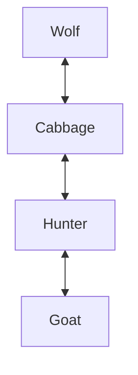

> [!info]
> 
> You have 4n counters of 4 types: n wolves, n goats, n cabbages, and n hunters. The aim is to place them in a row such that no-one is in danger: no hunter is next to a wolf, no wolf is next to a goat, no goat is next to a cabbage. Also no two counters may be placed next to each other. How many ways are there to solve the puzzle?

First you can write down the rules in the opposite way. The question defines what can't be next to what, so we can say what can be next to what.  
  
G can be next to H  
H can be next to C & G  
W can be next to C  
C can be next to H & W  
  
This can be visualised by turning each into its own node, and making arrows to what it can be next to:  
W <--> C <--> H <--> G  

  
Evidently from this we can see that for all n, the sequence must start at W or G, because if it does not we would not be able to have an equal amount of all counters. For example, for n = 1, we can do WCHG or GHCW. For n = 2 we can do, WCWCHGHG or GHGHCWCW, and so on, given our restriction of all counters being equal in number.  
  
∴ We can conclude that for all n, there are two solutions, starting with either W or G  
  
(this ended up being quite a similar answer to Blake, great minds must think alike haha)