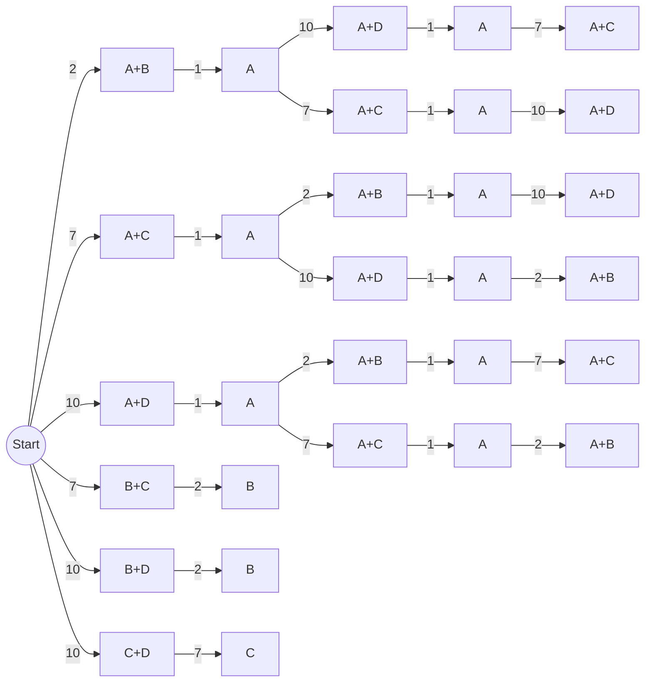

#algo #graphtheory 

Four friends need to cross a bridge. They start on the same side of the bridge.

A maximum of two people can cross at any time.

It is night and they have just one lamp. People that cross the bridge must carry the lamp to see the way.

A pair must walk together at the rate of the slower person.

-   Ann takes 1 minute to cross
-   Ben takes 2 minutes to cross
-   Con takes 7 minutes to cross
-   Dora takes 10 minutes to cross

In the forum, collaborate with your classmate:

1.  Represent the model as a graph/digraph or tree.
2.  Describe using Graph Terminology the properties of each model.
   
As you can see from this partial tree diagram (it was too much effort to complete it 😭), the problem can also be modelled similar to events in probability, where every possible action after one action is noted down in a tree like structure.

In this case, the nodes represent a person (or pair) walking across the bridge, and the edges represent the process of crossing the bridge, the number showing the amount of time this takes.

   ```mermaid
graph TB
	A((A: 1))
	B((A: 2))
	C((A: 7))
	D((A: 10))
```

