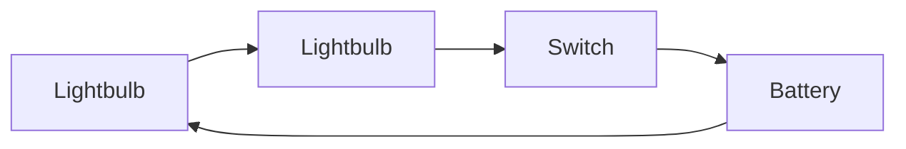
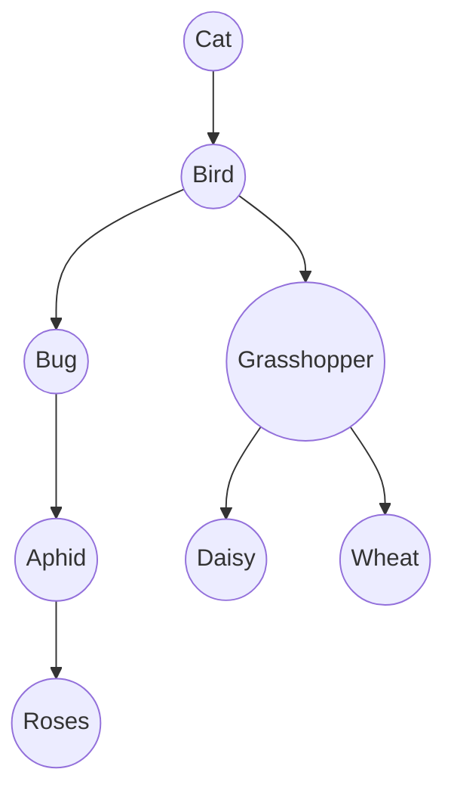

#algo #graphtheory

> [!info]
> 
> For each scenario below:  
> a) represent the model as a graph/digraph or tree  
> b) describe the properties of the model using graph terminology.

> Connections of two light bulbs, a battery and a switch as an electric circuit with wire.

This is a connected, directed cyclic graph, where the nodes represent items in the circuit and the edges represent wires 

> The food chain of one of the following living things: cat, bird, bug, grasshopper, aphid, rose, daisy, wheat.

This would be a directed tree, where the root is the top of the food chain. The leaves of the tree are the bottom of the food chain (Roses, Daisy and Wheat). Nodes represent living things and edges who eats what. Edges represent who eats what, the tail being the eater and the head being the food.

3.  A character map of your favourite TV show or film.
4.  Allies and enemies from World War II.
5.  The main elements of the story of Goldilocks and The Three Bears.