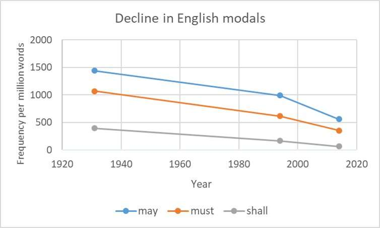

## The Change of Gender in English

Out of the many difficulties of learning a new language, one of the most foreign concepts for native English speakers tends to be that of grammatical gender, where all nouns are classified into their own gender. This common feature of many languages surprisingly close to English leads to an obvious question: why did English lose its grammatical gender and how did such a large syntactic change occur over such a short time, leaving nothing but the smallest remnants in Modern English?

Some may find it surprising that Old English had a very intricate system of inflections for each of its 5 grammatical cases. Since then, there has been a significant inflection reduction, namely during the Middle English period where the -a, -u and -e suffixes all merged into the ending -e. Similarly, of the extensive case system, only 3 cases remaining in most modern usage and that too with much simplified inflections. Of these cases, the nominative case is particularly interesting as it houses most of our previous grammatical gender, one that many of the modern Germanic languages share with three categories: masculine, feminine and neuter. Nouns were assigned to one of these gender classes in "classical" West Saxon, where grammatical gender was well manifested, but over time there was a systematic process of syntactic and morphological change due to the decay of inflectional ending in English during the Middle English period. As English expanded further through the British Isles, contact with the languages from the north of England resulted in an overall decline of grammar, where consistency was simply not as important as it used to be due to the vast span of the language. 

Within the nominative case, Old english had a vast system of inflectional morphemes that grouped nominal lexical items into their gender categories which always resolved to the gender of the person they were referring to. As we can see below, many lexemes in Old English had inflectional morphemes that denoted gender:

- bæcere/bæcestra "baker"

- beþæcend/beþæcestre "deceiver"

- cempa/cempestre "warrior"

- lufiend/lufestre "lover"

- tæppere/tæppestre "tavern keeper"

From the above list, there is a clear pattern that the suffix "-estre" marks the feminine gender case for nominal lexemes, but equally if not more common would be the irregular nouns with a range of essentially unrelated suffixes:

- fyrenhycga/fyrenhycge "adulterer/ess"

- horig/hora "fornicator"

- nefa/nefene "nephew/niece"

- þeow/þeowe "slave"

- neahgebur/neahgebyrild "neighbour"

Even more confusingly, many unambiguously female nouns are assigned to the masculine gender with the suffix "-man/mon"

- fæmenhadesmon "virgin"

- hiredwifmon "female member of a household"

- mægdenman "virgin"

- mægþman "virgin"

- wifmann "women"

Evidently, the examples above illustrate that the grammatical gender of a predicate in Old English did not always align with the natural gender of its subject, which would have been rather complicated namely for non-native speakers to pick up.

This precisely demonstrated why grammatical gender had such a large downfall moving into the Middle English period: it was inconvenient and too complicated for newcomers to learn. For the same reasons Middle English saw an overall decline of inflections and accents, grammatical gender became an oversight as the language expanded and most suffixes began defaulting to their neuter form. As expansion and contact with new tribes often does, the "new English" that came about from the settlement of North England filtered out the complex elements of respective language, gradually washing away the remnants of an extensive grammatical gender system with it too.

\newpage

## Caxton & The Printing Press

One of the most influential inventions in the history of the English language would be the printing press, brought to England by one William Caxton in 1476. The machine was revolutionary, making books orders of magnitude cheaper to produce and buy, and therefore caused the levels of literacy in the common English people to climb much higher than before. As the printing press was fixed in its codification, it also marked the beginning of a greater standardisation of syntax across the language.

Caxton started off as a successful merchant, serving as the governor of the 'English Nation of Merchant Adventurers' for the better part of a decade. This not only allowed him to build a strong standing in the merchant community, but also act as a diplomat for the King at the time, through the process of which he gained a significant wealth. 

In the early 1470s, his interests turned to literature and he started the work of translating books from French to English. Through these ventures, Caxton spent some time in Cologne, Germany learning of the printing presses they had started developing. Although printing with movable type had been invented many centuries earlier in China, the technology was not well developed in Europe until the mid-15th century, meaning that the printing press was quite new at the time. As he worked on his own eventual translation of *'Recueil des histoires de Troye'* (which later become the first book in history to be printed in English), he later recounted that how his "pen became worn, his hand weary, his eye dimmed" with the laborious task of copying the book. Simply, he found the work such a bore that he "practiced and learnt" at a great personal cost how to print it instead. The next year, toward the end of 1476, Caxton returned to England and established the now famous press at Westminster.

At the time, most continental printers made their books in Latin, the international language of the time, so that they could sell them to a wider market. Caxton chose to ride against this wave, and though they were still a luxury aimed at fairly wealthy people, over the coming decades the price of books fell heavily as he streamlined the process and reshaped the way in which people acquired books for information and entertainment.

Caxton was also responsible for the spread of the variety of English which was to become the standard throughout England. The need for a standard was becoming increasingly evident; as more books were produced, there was a need for a standard syntax to be agreed upon. Caxton adopted a certain variety of Middle English (the so called 'King's English') that was commonly used in London at the time, and spread this variety throughout England by his trade. 

Though it cannot be asserted if this was a conscious choice or not, he most certainly put quite some thought and effort into the selection of syntax and lexemes to suite his preferences, as accounted in his 'egges' story. Therewith other dialects of English were marginalised and many died out, but Caxton's work set out the groundwork for what we know today as the world's language. This work, so instrumental to the language we speak today, marked the start of a transition to modern English, but it was not until the first dictionaries were published that this standardisation would be further improved and blossom to maturity. 

\newpage

## The Rise of the Internet - A New Era for the English Language

The internet has changed the world forever. From how we see the world to how we speak about it, the shift in the English Language has been majorly influenced by the way we communicate online. The internet has caused the lexical shift of pre-existing words, started the emergence of  "eLanguage", a register consisting of internet-related terms, acronyms and spellings and generally sped up the process of language change in English.

The internet has introduced many new words in the average person's lexicon. To the general population, this may end at lexemes such as as "email", "blog" and "app", but for the generation that has grown up with the internet, this new vocabulary extends much further. Internet "memes", a whole new concept in and of itself, have resulted in many slang words reaching mainstream popularity. Lexemes such as "rizz", "slay", "touching grass" and "the ick" have spread further than any slang before the internet age, and in rare cases stick around to join the coveted ranks of our English Language.

The fall of formality can also be accredited to the rise of the internet. Though this may be alarming to some, it is far from surprising: as people spend more time talking online in informal contexts, a shadow of their online syntax creeps into their academic work. For example, take [this academic paper](https://www.cambridge.org/core/journals/religious-studies/article/abs/faith-as-extended-knowledge/7072E6F301E99089D56A5DFB7B4B662B) published in 2017, a form of writing that has tended to be as formal as it gets. What is surprising about this text is the high frequency of informal features, including contractions (*isn't*) and first/second person pronouns, all of which would have been an abnormality before the age of the internet:

> "For at least on a popular Christian conception, when **you** believe something truly on the basis of faith this **isn't** because of anything **you're** naturally competent to do…**I argue** in this article that **there's** no deep tension between faith-based knowledge and virtue epistemology."
> - Kegan J. Shaw, Cambridge University Press

Modal verbs such as "must", "may", and "shall" have seen an all time low since the start of the internet. This decline was present well before the internet came about to speed it up, but phrases from only a few decades ago now feel archaic:

> "Of course, we shall not be staying here long."
> "May I take my jacket off, please?"
> - British National Corpus 1994

Simply put, the internet has pushed the boundaries of informality. The way we now communicate online somewhat resembles the telegraphic stage of child language acquisition, where children typically from the ages of around 18 to 24 months old use only the necessary words such as nouns, verbs and adjectives and omit function words such as prepositions and conjunctions. Online communication follows similar patterns; previously pressured by the monetary incentives of short messages, online language has remained laconic and efficient, focused solely on conveying meaning with the fewest words possible. This could be attributed to the fast-paced nature of online communities, creating pressure on our language for quick and concise communication.

The presence of the internet has also caused the lexical shift of words previously well established in the English lexicon. For many younger people, the word "viral" would describe content that has gained rapid popularity rather than the older spreading that implied a virus. The word "tweet" could also be considered a similar case, though this would more so fall into the category of genericisation, similar to "google" or "band-aid".

Overall, in a more globalised world, the internet gives rise to a new register of communication, incorporating elements of many languages and dialects to bring them to a mainstream audience. English, like all languages is constantly evolving and the internet is merely one of the many influences that shapes its trajectory, but we can stand back and watch in awe as the words we speak morph in front of our very eyes.

\newpage

## The Future of English

Language changes, and the future of English will be no exception. Due to the global role of English, the emergence of new dialects and variations will play a large part in the fate of this language, along with the major influence of technology.

Latin, once the lingua franca of the pre-modern Europe, gave birth to several regional dialects, and over time these eventually evolved into the modern Romance languages. A similar phenomenon can be observed today with English, namely in countries where it functions as a second language. The emergence of "interlanguages" combine features of English with native regional languages, mixing phonetics, syntax, and lexemes into new variations. Examples include "Singlish" in Singapore, "Hinglish" in India and "Spanglish" in the United States. It can very easily then be hypothesised that English may bare a similar fate, splitting up into regional languages and perhaps evolving into a different form in the United States (the country with the largest concentration of native English speakers in the world).

The rise of online language has also lead to the relaxation of language rules, and attitudes towards consistently and correctness have shifted to be more lenient. Just as English said goodbye to its complicated inflectional system almost a millennia ago when coming in contact with new groups, online communities have found new ways to make the language more accessible and easier to use. Though these shifts tend to be viewed as informal at first, many stand the test of time, and there could possibly even be a slight reversal of the standardisation from Middle to Modern English such that there are competing norms for how the language should be used.

Overall, the future of English will be shaped by its role as a global language across borders, both digitally and in the hearts of many cultures worldwide.

\newpage

## Bibliography

1. Al Kadi, A & Ahmed, R 2018, *(PDF) Evolution of english in the internet age*, ResearchGate, viewed 12 August 2023, [https://www.researchgate.net/publication/323052712_Evolution_of_english_in_the_internet_age](https://www.researchgate.net/publication/323052712_Evolution_of_english_in_the_internet_age).

2. Curzan, A 2003, *Gender Shifts in the History of English*, Cambridge University Press.

3. Favilla, E 2017, *How the internet changed the way we write – and what to do about it*, The Guardian.

4. Godwin, R 2019, *How the internet is changing language as we know it (ikr lol)*, the Guardian, viewed 13 August 2023, [https://www.theguardian.com/books/2019/oct/11/how-to-speak-internet-online-writing-richard-godwin](https://www.theguardian.com/books/2019/oct/11/how-to-speak-internet-online-writing-richard-godwin).

5. Hist, S-GC n.d., *How did William Caxton influence and change modern English Language?*, Shorthand.

6. Horobin, S 2015, *What will the English language be like in 100 years?*, The Conversation, viewed 13 August 2023, [https://theconversation.com/what-will-the-english-language-be-like-in-100-years-50284](https://theconversation.com/what-will-the-english-language-be-like-in-100-years-50284).

7. Jones, C 2015, *Grammatical Gender in English*, Routledge.

8. Knibbs, K 2013, *How Internet-speak is changing the way we talk | Digital Trends*, Digital Trends, viewed 13 August 2023, [https://www.digitaltrends.com/social-media/how-the-internet-is-changing-the-way-we-talk/](https://www.digitaltrends.com/social-media/how-the-internet-is-changing-the-way-we-talk/).

9. *Middle English, the Standardisation of English and the Printing Press* 2012, My English Language, viewed 12 August 2023, [https://www.myenglishlanguage.com/history-of-english/middle-english/](https://www.myenglishlanguage.com/history-of-english/middle-english/).

10. The Editors of Encyclopedia Britannica 2019, *William Caxton | Biography & Facts*, *Encyclopædia Britannica*.

11. The Ohio State University n.d., *The Cases in English | Department of Classics*, classics.osu.edu, viewed 12 August 2023, [https://classics.osu.edu/Undergraduate-Studies/Latin-Program/Grammar/Cases/English-Case](https://classics.osu.edu/Undergraduate-Studies/Latin-Program/Grammar/Cases/English-Case).

12. Tokošová, K & Vogel, M 2015, *Reduction in Noun and Adjective Inflections in Middle English Texts*, 3 June, Masaryk University, Faculty of Education, viewed 12 August 2023, [https://is.muni.cz/th/qu7t4/Tokosova_Bachelor_thesis.pdf](https://is.muni.cz/th/qu7t4/Tokosova_Bachelor_thesis.pdf).
